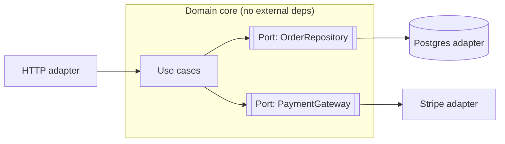

# Clean & Hexagonal Architecture

## Concept

- **Hexagonal Architecture** (Ports and Adapters) and **Clean Architecture** are the same core idea expressed two ways: isolate your **business logic** from external concerns (databases, web frameworks, message brokers, third-party APIs) so the logic depends on **nothing** external.
- The governing rule is the **Dependency Rule**: dependencies point **inward**. The domain/core is at the center and knows nothing about the outside; outer layers (infrastructure, UI) depend on the core, never the reverse.
- **Ports** are interfaces the core defines for what it needs ("I need to save an order," "I need to charge a card"). **Adapters** are the outer implementations (a Postgres repository, a Stripe client, an HTTP controller) that plug into those ports.
- Dependency Inversion (the "D" in SOLID, Phase 1) is the mechanism: the core declares the interface; infrastructure implements it; a composition root wires them at startup.

## Problem It Solves

- Decouples business rules from frameworks and I/O, so you can **swap infrastructure** (Postgres → DynamoDB, REST → gRPC, Stripe → Adyen) by writing a new adapter — the core is untouched.
- Makes the core **trivially testable**: unit-test use cases against in-memory fake adapters with no database, network, or framework.
- Stops framework and database details from **leaking** into and dictating business logic (the classic problem where ORM entities and HTTP request objects pollute the domain).
- Extends the lifespan of the codebase: frameworks change every few years; well-isolated business rules survive them.

## Trade-offs

- **Decoupling vs. boilerplate** — every external dependency becomes an interface plus an adapter plus wiring; for a simple CRUD app this indirection is pure overhead.
- **Mapping cost** — you translate between domain objects and DB/DTO representations at the boundaries instead of using ORM entities directly everywhere.
- **Risk of over-abstraction** — ports for things that will never have a second implementation add ceremony without payoff.
- **Team discipline** — the architecture only holds if everyone respects the dependency rule; one shortcut (importing the ORM in the core) starts the erosion.
- **Best fit** — complex, long-lived domains with real business rules; least useful for thin, data-in-data-out services.

## Examples

- **Swappable persistence**
  - The use case `PlaceOrder` depends on an `OrderRepository` port. In production a `PostgresOrderRepository` adapter implements it; in tests an `InMemoryOrderRepository` does — same use case, no DB needed to test.
- **Framework at the edge**
  - The HTTP controller is a thin adapter that parses the request, calls a use case, and formats the response. Business logic lives in the use case, so switching from Express to Fastify (or HTTP to a queue trigger) changes only the adapter.
- **Relation to DDD**
  - Hexagonal architecture is the common *implementation shell* for a DDD domain model (topic 26): the bounded context's model sits in the core; repositories and gateways are ports/adapters.
- **Interview framing**
  - When asked about testability or "what if we change databases," describe ports-and-adapters and the inward dependency rule. Note it's worth it for complex domains and overkill for simple CRUD — showing you apply it with judgment, not dogma.
