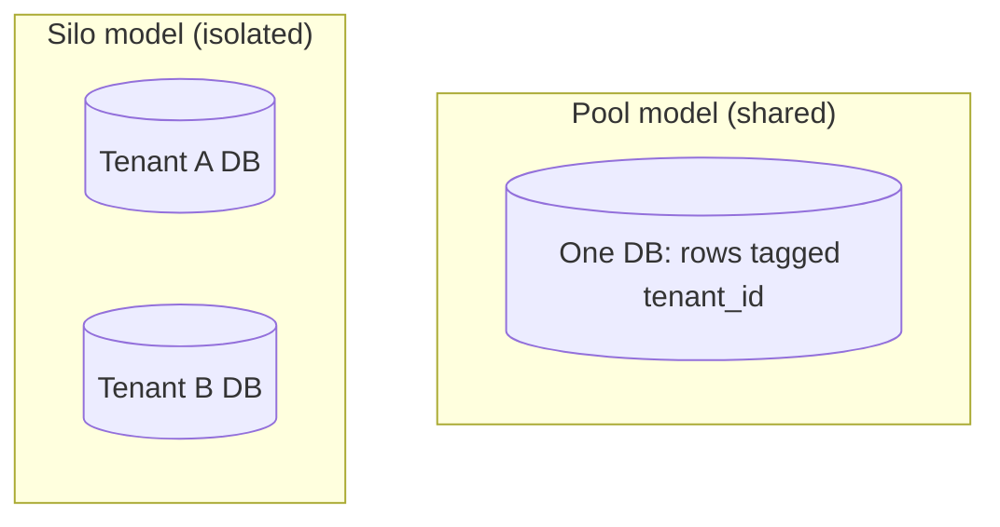

# Multi-Tenant Architecture

## Concept

- A **multi-tenant** system serves many customers (**tenants**) from shared infrastructure, while keeping each tenant's data and configuration **isolated**. It is the foundational architecture of nearly every B2B SaaS product.
- The central design axis is the **isolation model**, which trades isolation strength against cost and operational simplicity:
  - **Silo (database-per-tenant)** — each tenant gets its own database/instance. Strongest isolation and per-tenant tuning/compliance; highest cost and operational overhead; hard to scale to thousands of tenants.
  - **Bridge (schema-per-tenant)** — one database, a schema per tenant. Good isolation, moderate cost; schema migrations must fan out across all schemas.
  - **Pool (shared schema, `tenant_id` column)** — all tenants share tables, every row tagged with `tenant_id`. Cheapest and most scalable; weakest isolation — a missing `WHERE tenant_id = ?` is a cross-tenant data leak.
- Most large SaaS uses **pool** by default and **silo** for enterprise customers who pay for isolation — a hybrid.

## Problem It Solves

- Lets one codebase and one operational footprint serve thousands of customers cost-effectively — the economics that make SaaS viable.
- Centralizes upgrades and operations: deploy once, every tenant gets the new version.
- Provides a spectrum of isolation so you can match each tenant's compliance, performance, and price tier to the right model.
- Enables per-tenant customization (config, feature flags, branding) on shared infrastructure.

## Trade-offs

- **Cost/scale vs. isolation** — pool is cheap and scales but risks data leakage and **noisy neighbors** (one tenant's heavy load degrades others); silo isolates fully but multiplies cost and ops.
- **The cross-tenant leak risk (pool)** — every query, cache key, and background job must scope by tenant; a single missed filter is a serious breach. Enforce with row-level security, a tenant-aware data layer, or query interceptors — never rely on developers remembering.
- **Noisy neighbor** — needs per-tenant rate limits, quotas, and sometimes resource pools/cells (Phase 4) to contain blast radius.
- **Migrations** — pool migrates one schema; bridge/silo must migrate hundreds or thousands of schemas/DBs (with online-migration tooling, topic 12).
- **Per-tenant data export/delete** — GDPR-style "delete this tenant" is trivial in silo, a careful scoped operation in pool.

## Examples

- **Pool with enforced isolation**
  - Postgres **Row-Level Security**: a policy `tenant_id = current_setting('app.tenant_id')` is applied to every query automatically, so the database — not application code — guarantees scoping.
- **Hybrid tiering**
  - Self-serve customers share a pooled cluster; an enterprise customer with HIPAA requirements gets a dedicated silo database — same application code, different deployment.
- **Tenant context propagation**
  - The tenant ID is resolved at the edge (subdomain, JWT claim) and flows through every layer — request, cache key (`tenant:42:...`), queue message, and background job — so nothing crosses tenants.
- **Noisy-neighbor control**
  - Per-tenant rate limits and connection quotas; for the largest tenants, dedicated worker pools or cells so their spikes don't starve others.
- **Interview framing**
  - When designing SaaS, lead with the isolation model and justify it (pool for scale/cost, silo for compliance, hybrid in practice). Calling out tenant-scoping enforcement (RLS) and noisy-neighbor mitigation is strong signal.
