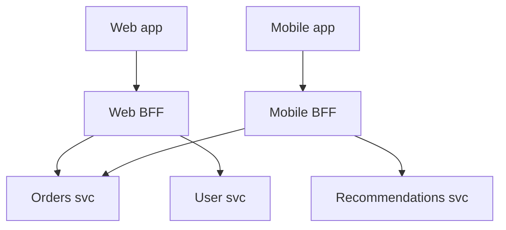

# Backend-for-Frontend (BFF)

## Concept

- A **Backend-for-Frontend** is a dedicated backend layer built for **one specific frontend/client type** - one BFF for web, one for iOS, one for the public API - instead of every client talking to a single general-purpose API.
- Each BFF aggregates and reshapes data from downstream services into exactly what *its* client needs, in *its* preferred shape, with *its* auth and caching rules.
- It solves the problem that web, mobile, and third-party clients have genuinely different needs: mobile wants a few compact, aggregated payloads to save battery and bandwidth; web can make many granular calls; each evolves at its own pace.
- A BFF is a specialized application of the API gateway (topic 7) idea: where a gateway is one shared edge for all clients, a BFF is **one edge per client experience**, owned by the team that owns that experience.

## Problem It Solves

- **Over/under-fetching**: a one-size-fits-all API forces mobile to either download more than it needs or make many round trips; a mobile BFF returns one tailored payload.
- **Aggregation/composition**: the BFF fans out to several services in parallel and stitches the result, so the client makes a single call (crucial on high-latency mobile networks).
- **Client-specific concerns**: different auth (web cookies vs. mobile tokens), caching, rate limits, and response shapes live in the BFF, not polluting downstream services.
- **Team autonomy**: the frontend team owns its BFF and can iterate on the API contract without waiting on backend service teams.
- It decouples client release cycles from backend service changes (the BFF absorbs the translation).

## Trade-offs

- **Tailored APIs vs. duplication**: multiple BFFs can duplicate logic (auth, aggregation); share common pieces via libraries or a thin shared gateway beneath the BFFs.
- **More services to operate**: each BFF is another deployable to build, monitor, and scale.
- **Risk of a new monolith**: putting business logic (not just composition) into a BFF turns it into a fat layer that duplicates the domain; keep BFFs to aggregation/translation.
- **GraphQL as an alternative**: a single GraphQL gateway lets each client request exactly the fields it needs, sometimes removing the need for per-client BFFs (at the cost of GraphQL's own complexity).
- **Consistency**: divergent BFFs can expose subtly different behavior for the same operation across clients if not coordinated.

## Examples

- **Mobile vs. web**
  - The mobile BFF returns a single `home` payload (profile + 3 recent orders + 5 recommendations, trimmed fields). The web BFF exposes finer-grained endpoints the rich web UI calls as needed.
- **Composition**
  - One product-page request to the BFF triggers parallel calls to catalog, pricing, inventory, and reviews services; the BFF merges them into one response, hiding the fan-out from the client.
- **Third-party API**
  - A separate public-API BFF enforces stricter rate limits, versioning, and a stable contract for external developers, independent of internal client BFFs.
- **GraphQL alternative**
  - Instead of three BFFs, a GraphQL layer lets web and mobile each select their fields - a different solution to the same over/under-fetching problem.
- **Interview framing**
  - Introduce a BFF when web and mobile have materially different data/latency needs, or to aggregate chatty service calls for mobile. Note the GraphQL alternative and warn against letting the BFF absorb domain logic - it should compose and translate, not own business rules.
