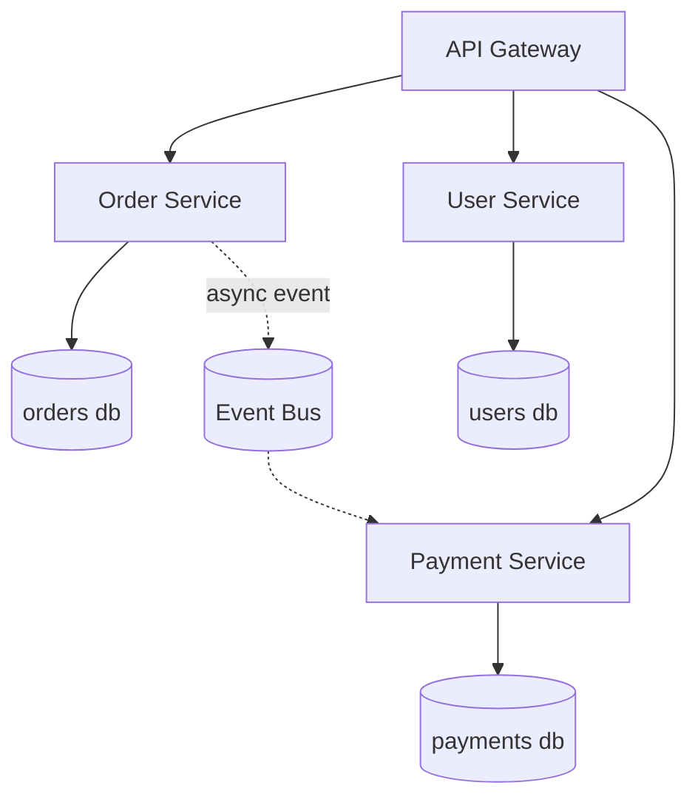

# Microservices Architecture

## Concept

- **Microservices** decompose an application into independently deployable services, each owning a single business capability and its own data store.
- Services communicate over the network - synchronously (REST/gRPC, topics in Phase 2) or asynchronously (queues/events, topic 19) - never by sharing a database.
- The defining property is **independent deployability**: each service is built, tested, deployed, and scaled on its own cadence by its own team.
- Microservices are an *organizational* scaling pattern as much as a technical one (Conway's Law): they let many teams ship in parallel without a shared release train. They are not a goal in themselves and carry heavy operational cost.

## Problem It Solves

- Independent deploys: a fix in Payments ships without redeploying Orders, removing the shared-release-train bottleneck.
- Independent scaling: scale only the hot service (e.g., 50 replicas of search, 3 of billing).
- Fault isolation: a crashing service degrades one capability instead of the whole app (with bulkheads and circuit breakers, topics in Phase 4).
- Tech heterogeneity: the right language/datastore per service.
- Team autonomy: clear ownership maps services to teams.

## Trade-offs

- **Autonomy vs. distributed-systems tax**: you inherit network latency, partial failure, retries, timeouts, and the need for service discovery, tracing, and a gateway.
- **Independent data vs. lost ACID**: no cross-service transactions; you need sagas (Phase 4) and eventual consistency, which is far harder than a single DB transaction.
- **Flexibility vs. operational cost**: many pipelines, dashboards, on-call rotations; observability becomes mandatory, not optional.
- **Decoupling vs. distributed monolith**: wrong boundaries produce services that must deploy together - all the cost, none of the benefit.
- **Premature adoption**: splitting before you understand the domain locks in the wrong boundaries; start with a modular monolith (topic 2).

## Examples

- **Right reasons to split**
  - A component needs independent scaling (search), independent compliance (payments/PCI), or a different runtime (an ML inference service in Python beside a Java app).
  - Two teams are blocked on each other's deploys.
- **The distributed monolith anti-pattern**
  - Services that share a database, or that must be deployed in lockstep, or that synchronously call five other services to serve one request - these have microservice cost with monolith coupling.
- **Communication choices**
  - Synchronous (gRPC) for low-latency request/response inside the mesh.
  - Asynchronous events for decoupling - Order emits `OrderPlaced`; Payment and Shipping react without Order knowing about them.
- **Interview framing**
  - Justify each split with a concrete driver (scale, compliance, team boundary). Saying "microservices because scale" without numbers is a red flag; identifying the *one* capability that needs its own service is senior signal.
