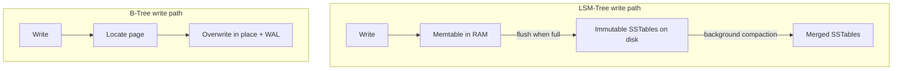

# Storage Engines: B-Trees vs. LSM-Trees

## Concept

- The **storage engine** decides how rows are physically laid out on disk and how reads/writes touch it. Two designs dominate, and the choice shapes a database's read/write performance profile.
- **B-Tree** (Postgres, MySQL/InnoDB, most relational DBs): a balanced, sorted tree of fixed-size pages, updated **in place**. To change a value, the engine finds its page and overwrites it. Reads are fast and predictable (a few page lookups); writes do random in-place I/O.
- **LSM-Tree** (Log-Structured Merge-Tree — Cassandra, RocksDB, LevelDB, ScyllaDB, HBase): writes go to an in-memory **memtable** and an append-only commit log, then flush as immutable sorted files (**SSTables**) to disk. Background **compaction** merges SSTables and drops obsolete versions. Writes are sequential and fast; reads may check several files.
- The trade-off is fundamentally about **where you pay**: B-Trees optimize reads and pay on writes (random I/O, write amplification from page splits + WAL); LSM-Trees optimize writes (sequential appends) and pay on reads and background compaction.

## Problem It Solves

- Explains *why* different databases excel at different workloads, so you pick the right one instead of guessing.
- **B-Trees** give low-latency point reads and efficient range scans with strong read consistency — ideal for read-heavy, transactional, mixed workloads (OLTP).
- **LSM-Trees** sustain very high **write throughput** because all writes are sequential appends, never random in-place updates — ideal for write-heavy ingestion (time-series, event logs, IoT, feeds).
- Compaction also gives LSM-Trees excellent **compression** (sorted immutable files compress well), lowering storage cost.

## Trade-offs

- **Write amplification** — B-Trees rewrite whole pages and the WAL per change; LSM-Trees rewrite data repeatedly during compaction. Each has write amplification, just at different stages.
- **Read amplification (LSM)** — a read may scan the memtable plus several SSTables; **Bloom filters** (Phase 4) mitigate this by quickly ruling out SSTables that can't contain the key.
- **Space amplification** — LSM keeps multiple versions/tombstones until compaction; B-Trees can leave page fragmentation. Both need maintenance (compaction / vacuum).
- **Read latency predictability** — B-Tree reads are steady; LSM read latency varies with how many SSTables a key spans and whether compaction is running.
- **Compaction cost** — LSM background compaction consumes CPU and I/O and can cause latency spikes ("compaction storms") if untuned.
- **Deletes** — LSM deletes write **tombstones** (not immediate removal); reclaiming space waits for compaction, which can surprise operators.

## Examples

- **Pick B-Tree (Postgres/InnoDB) when**
  - Read-heavy or balanced OLTP, complex queries, strong transactional needs, predictable low-latency reads — the default for most applications.
- **Pick LSM (Cassandra/RocksDB) when**
  - Write-heavy ingestion: sensor/IoT data, event streams, activity feeds, write-mostly counters — millions of writes/sec that a B-Tree's random I/O can't sustain.
- **Bloom filters + LSM**
  - Cassandra keeps a Bloom filter per SSTable so a point read skips files that definitely don't contain the key, cutting read amplification (ties to Phase 4 Bloom filters).
- **Same engine, different stores**
  - RocksDB (LSM) is embedded inside many systems (Kafka Streams state stores, CockroachDB, TiKV) precisely for its write throughput.
- **Interview framing**
  - When asked "Postgres or Cassandra?" or "why is this DB write-optimized?", answer in terms of storage engine: "LSM-Trees turn writes into sequential appends for high write throughput at the cost of read and compaction overhead; B-Trees update in place for fast predictable reads." This read/write-amplification reasoning is a classic Staff-level differentiator.
