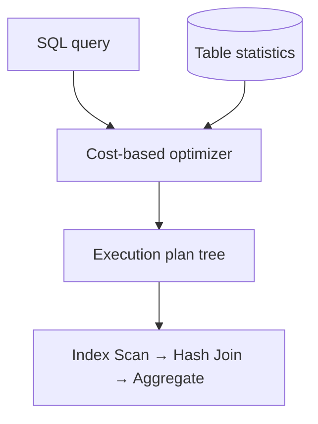

# Query Optimization & Execution Plans

## Concept

- A SQL query is **declarative** - it says *what* you want, not *how* to get it. The database's **query planner/optimizer** decides the actual execution strategy: which indexes to use, which join algorithm, and in what order to access tables.
- The optimizer is **cost-based**: it estimates the cost of candidate plans using **table statistics** (row counts, value distributions, index selectivity) and picks the cheapest. Stale or missing statistics lead to bad plans.
- `EXPLAIN` (and `EXPLAIN ANALYZE`, which actually runs it) shows the chosen plan as a tree of operations - the single most important tool for diagnosing slow queries.
- Key things a plan reveals: **Seq Scan** (full table scan) vs **Index Scan**; the **join algorithm** (nested loop, hash join, merge join); estimated vs **actual** row counts (big divergence = bad statistics); and where time is spent.

## Problem It Solves

- Turns "the query is slow" from guesswork into diagnosis: read the plan, find the expensive node (a Seq Scan on a huge table, a nested loop over millions of rows), and fix the root cause.
- Lets you verify that an index is actually **used** (adding an index the planner ignores does nothing) and that estimates match reality.
- Surfaces the classic killers: **full table scans** from missing/unusable indexes, **N+1 query** patterns from ORMs, and **bad join orders** from stale statistics.
- Guides index design (topic 10) and query rewriting for orders-of-magnitude speedups.

## Trade-offs

- **Indexes help reads but cost writes**: adding indexes to satisfy the planner slows inserts/updates (topic 10); optimize the queries that matter, not every query.
- **Planner estimates can be wrong**: out-of-date statistics, skewed data, or correlated columns cause the optimizer to choose poorly; `ANALYZE`/auto-vacuum keep stats fresh.
- **Query rewrite vs. index**: sometimes the fix is rewriting the query (avoiding a function on an indexed column that defeats the index, replacing `OR` with `UNION`, removing `SELECT *`) rather than adding an index.
- **Join algorithm matters at scale**: a nested-loop join is fine for small inputs but catastrophic for large ones where a hash join belongs; the planner usually gets this right *if* statistics are good.
- **Plan caching/parameter sniffing**: cached plans for parameterized queries can be optimal for one parameter and terrible for another.

## Examples

- **Reading EXPLAIN ANALYZE**
  - A query showing `Seq Scan on orders (rows=5,000,000)` where you expected an index scan signals a missing/unusable index or a non-sargable predicate (e.g., `WHERE lower(email)=...` without a matching expression index).
- **Killing N+1**
  - An ORM that loads 100 orders then issues 100 separate queries for each order's items - replace with a single `JOIN` or a batched `IN (...)` query. The plan and query count make this obvious.
- **Estimate vs. actual divergence**
  - Plan estimates 10 rows, actual is 2,000,000 → stale statistics; running `ANALYZE` lets the optimizer pick a hash join instead of a nested loop.
- **Sargable predicates**
  - `WHERE created_at >= '2024-01-01'` can use an index; `WHERE date_trunc('day', created_at) = ...` often cannot - rewrite or add an expression index.
- **Interview framing**
  - When a design has a slow read, say "I'd `EXPLAIN ANALYZE` it, look for seq scans and bad row estimates, check the join algorithm, and fix with an index, a query rewrite, or fresher statistics." Mentioning N+1 and sargability shows hands-on depth beyond "add an index."
