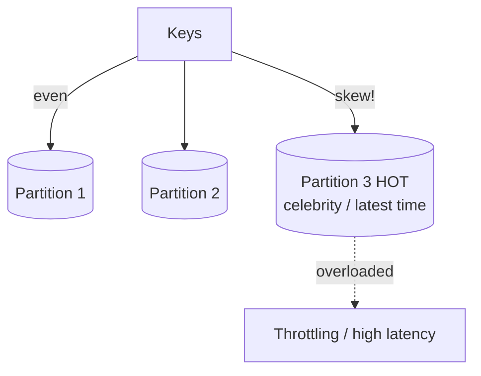

# Partitioning Strategies & Hot Partitions

## Concept

- **Partitioning** divides a large dataset into smaller pieces. **Sharding** (topic 14) spreads partitions across *machines* to scale; partitioning also happens *within* a single database (table partitions) to keep indexes small and enable fast pruning and deletion.
- The **partition key** + strategy decides which partition a row lands in:
  - **Hash partitioning** — `hash(key) % N`. Spreads load evenly; destroys range-query locality; resizing remaps most keys (use consistent hashing, Phase 4).
  - **Range partitioning** — contiguous key/time ranges per partition. Enables efficient range scans and cheap drop-old-partition deletes; prone to hot spots on the active range.
  - **List/directory partitioning** — explicit mapping (by region, tenant, category); flexible, needs a maintained map.
- The central failure mode is the **hot partition** (a.k.a. hot shard / hot key): one partition receives a disproportionate share of traffic or data, becoming a bottleneck while others sit idle — defeating the whole point of partitioning.

## Problem It Solves

- Keeps each partition's data and index small enough to fit in memory and stay fast, even as the total dataset grows huge.
- Enables **partition pruning**: a query filtered by the partition key touches only relevant partitions, not the whole table.
- Makes lifecycle operations cheap: dropping last month's data is a `DROP PARTITION` (instant) instead of a giant `DELETE` (topic 34).
- Correct key choice spreads load evenly, which is the prerequisite for linear horizontal scaling.

## Trade-offs

- **Even distribution vs. query locality** — hash spreads load but scatters range queries; range keeps locality but invites hot spots. You usually can't have both.
- **Hot partitions** arise from: **low-cardinality keys** (few distinct values), **monotonic keys** (timestamp/auto-increment → all new writes hit the newest partition), and **skewed access** (a celebrity user, a viral item).
- **Mitigations cost complexity** — **key salting** (append a bucket suffix: `userId#0..N`) spreads a hot key across partitions but makes reads fan out and re-merge; **composite keys** combine a high-cardinality prefix with the natural key.
- **Rebalancing** — fixing a hot partition in production often means resharding/splitting, an expensive operation; consistent hashing limits the blast radius.
- **Secondary access patterns** — a key great for one query is bad for another; you may need secondary indexes (topic 33) or a second copy keyed differently.

## Examples

- **Monotonic hot spot**
  - Partitioning events by `created_at` (range) sends every new write to the latest partition — a write hot spot. Fix: partition by `hash(event_id)`, or use a composite `(device_id, created_at)` so writes spread across devices.
- **Celebrity problem**
  - Keying a social graph by `user_id` works until a celebrity with 100M followers concentrates load on one partition. Mitigation: salt the celebrity's key into sub-partitions, or special-case high-fan-out accounts.
- **Salting a hot counter**
  - A global "likes" counter on a viral post is split into `post:42:shard:0..9`; writes hit a random shard, reads sum all ten — trading read fan-out for write distribution.
- **Cheap deletes via range partitions**
  - Time-range partitions let you `DROP PARTITION` for data past retention instead of a slow mass `DELETE` that bloats the table.
- **Interview framing**
  - Don't just say "shard by user_id" — immediately address distribution and hot partitions: "user_id is high-cardinality so load spreads, but a celebrity could hot-spot one partition, which I'd mitigate by salting that key." Naming the monotonic-key and celebrity hot-spot failure modes is strong senior/Staff signal.
