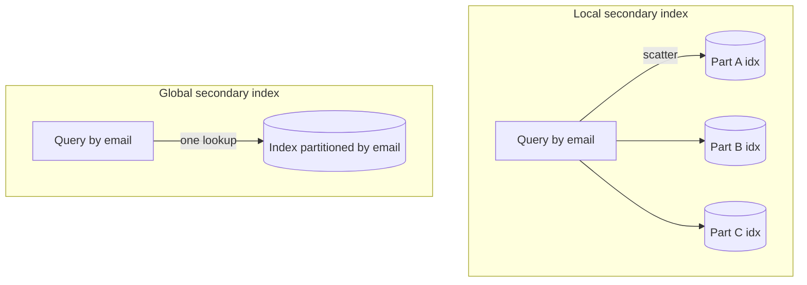

# Secondary Indexes

## Concept

- A **primary index** organizes data by its primary key (the shard/partition key in a distributed store). A **secondary index** lets you query by a *different* attribute efficiently - e.g., the table is keyed by `user_id`, but you also need to look up by `email`.
- In a single-node database this is routine (topic 10). In a **partitioned/distributed** store it is genuinely hard, because the secondary attribute's values are scattered across all partitions. There are two ways to build one:
  - **Local secondary index (LSI)**: each partition indexes only *its own* rows by the secondary attribute. Writes are cheap (local), but a query by the secondary key must **scatter-gather** across *every* partition.
  - **Global secondary index (GSI)**: a separate index partitioned by the *secondary* attribute, so a query goes to one place. Reads are efficient, but writes must update an index living on a *different* partition - a distributed, eventually-consistent write.
- This local-vs-global trade-off is one of the defining decisions in distributed data modeling.

## Problem It Solves

- Lets you serve **multiple access patterns** over the same data - query orders by `user_id` *and* by `status` *and* by `created_at` - without a full scan.
- A GSI turns an otherwise impossible "find by non-key attribute" query in a partitioned store into an efficient single-partition lookup.
- Avoids maintaining and synchronizing entirely separate denormalized copies of the data by hand.

## Trade-offs

- **Local (cheap writes, expensive reads)**: LSI keeps writes within one partition (consistent, fast) but every secondary-key read fans out to all partitions and merges results; gets slower as partition count grows.
- **Global (cheap reads, expensive/eventual writes)**: GSI reads hit one partition, but each base write must also write the index on another partition. This is a cross-partition write, so GSIs are typically **eventually consistent** - the index lags the base table briefly.
- **Write amplification**: every secondary index multiplies write cost; many GSIs make writes slow and expensive (DynamoDB literally bills per GSI).
- **Consistency surprises**: reading a GSI right after a write may not see the new row; designs must tolerate this lag.
- **Alternative: denormalized tables**: in some stores it's simpler to maintain a second table keyed differently (via the application or CDC), accepting the same eventual-consistency trade-off explicitly.

## Examples

- **DynamoDB**
  - Base table keyed by `userId`. An **LSI** lets you query a user's orders by `status` within that user (same partition). A **GSI** on `status` lets you query *all* orders with `status = SHIPPED` across all users - eventually consistent, separately provisioned.
- **Cassandra**
  - Native secondary indexes are local (scatter-gather, discouraged at scale); the idiomatic approach is **materialized views** or hand-maintained query tables - a second table written with a different partition key for each access pattern.
- **Scatter-gather cost**
  - With 100 partitions, an LSI query touches all 100 and merges - fine at low partition counts, a latency problem at high ones.
- **Relational contrast**
  - In single-node Postgres a secondary index is just `CREATE INDEX` - the distribution problem only appears once data is partitioned across nodes.
- **Interview framing**
  - When a partitioned design needs a second access pattern, name the choice: "local index = cheap writes but scatter-gather reads; global index = single-partition reads but eventually-consistent cross-partition writes." Mentioning query-tables/materialized views as the Cassandra idiom shows real distributed-data depth.
