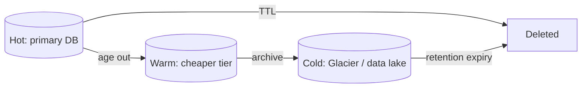

# Data Lifecycle & Archival

## Concept

- **Data lifecycle management** is the discipline of governing data from creation to deletion: how long it stays in fast/expensive storage, when it moves to cheaper tiers, when it's archived, and when it's permanently deleted.
- Not all data is equally valuable over time. Most systems exhibit a strong **recency bias**: recent data is hot (frequently read/written), older data is cold (rarely touched). Keeping everything in the primary database forever is expensive and slows the hot path.
- The core mechanisms:
  - **Tiering** — hot (in-DB / SSD / cache) → warm (cheaper DB / infrequent-access object storage) → cold (archive: Glacier/tape, slow and cheap).
  - **TTL / expiry** — automatically delete data after a fixed period (sessions, logs, OTPs).
  - **Archival** — move old records out of the operational store into a data lake / object store (topic 24) for analytics and compliance, keeping the OLTP database lean.
  - **Retention & deletion policy** — driven by legal/compliance (GDPR "right to be forgotten," financial record-keeping minimums).

## Problem It Solves

- **Cost** — storage cost is dominated by keeping cold data on hot infrastructure; tiering can cut storage spend by an order of magnitude.
- **Performance** — a lean operational database (smaller tables, smaller indexes, better cache hit rate) is faster; archiving old rows keeps the hot path fast.
- **Compliance** — enforces both *minimum* retention (keep financial records 7 years) and *maximum* retention (delete personal data on request / after a period) automatically rather than by ad-hoc scripts.
- **Operational sanity** — bounded data growth makes backups, migrations, and capacity planning tractable.

## Trade-offs

- **Cost vs. access latency** — colder tiers are far cheaper but slower to read (Glacier retrieval can take minutes to hours); archive only data you rarely need fast.
- **Deletion vs. recoverability** — hard deletes save space and satisfy privacy, but mistakes are unrecoverable; soft deletes (a `deleted_at` flag) are reversible but keep data around and complicate "truly deleted" guarantees.
- **Archival complexity** — moving data out means queries that span hot+cold data need a union/federated path, or you accept that old data is only available via the archive/analytics system.
- **Time-partitioning pays off here** — range partitions by time (topic 32) make archival a cheap `DROP PARTITION` instead of a slow mass `DELETE` that bloats the table and stresses replication.
- **Compliance edge cases** — "delete this user" must reach backups, caches, search indexes, logs, and analytics copies — not just the primary row.

## Examples

- **Object-storage lifecycle rules**
  - S3 lifecycle policy: keep logs in Standard for 30 days → transition to Infrequent-Access → transition to Glacier at 90 days → delete at 1 year — fully automated tiering and expiry.
- **Redis TTLs**
  - Sessions, OTPs, and rate-limit windows expire automatically via per-key TTL — no cleanup job needed.
- **OLTP → data lake archival**
  - Orders older than 18 months are exported (e.g., via CDC, Phase 4) to Parquet in a data lake and removed from the operational DB; analytics still query the full history in the lake.
- **GDPR deletion**
  - A "forget me" request triggers deletion across the primary DB, search index, caches, and a scheduled purge from backups within the retention window — a coordinated, audited operation.
- **Interview framing**
  - For any system that accumulates data forever (logs, events, messages, orders), proactively raise a retention/tiering policy: TTL the ephemeral, time-partition + archive the historical, and call out GDPR-style deletion reaching all copies. This production-maturity signal is often missed by candidates.
