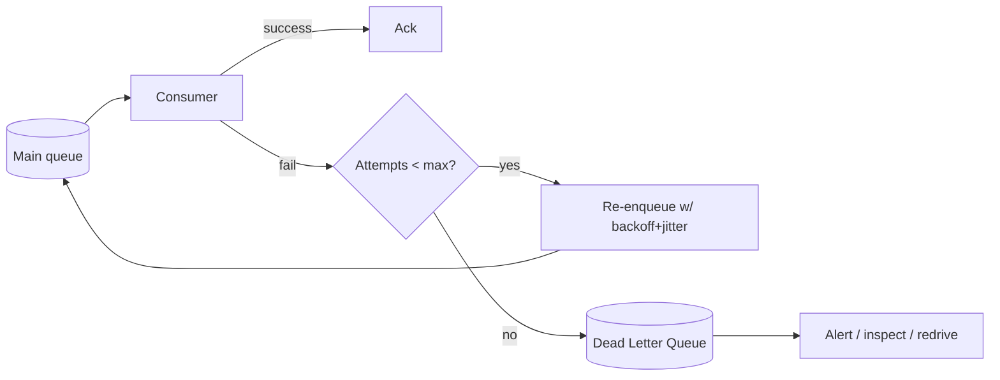

# Dead Letter Queues & Retry Strategies

## Concept

- In any asynchronous system (queues, topic 19; task queues, topic 20), some messages **fail to process**. A robust system needs a principled answer for *how* to retry and *what to do when retries are exhausted*.
- **Retry strategy** governs *how* you re-attempt a failed message:
  - **Immediate retry** — try again at once; only useful for instantaneous blips.
  - **Fixed-interval retry** — wait a constant delay between attempts.
  - **Exponential backoff** — wait 1s, 2s, 4s, 8s… giving a struggling dependency time to recover instead of hammering it.
  - **Backoff + jitter** — add randomness to the delay so many failed consumers don't retry in lockstep and create a synchronized **retry storm** (Phase 4).
- A **Dead Letter Queue (DLQ)** is a separate queue where messages are routed after they exceed the maximum retry count (or are malformed/"poison"). Instead of being lost or retried forever, they're parked for inspection, alerting, and manual or automated **redrive**.

## Problem It Solves

- **Transient failures** (a momentarily-down dependency, a timeout, a rate-limit) succeed on retry — backoff turns a temporary glitch into eventual success without human intervention.
- **Poison messages** (a malformed payload, a bug that always fails for this input) would otherwise be retried forever, blocking the queue and burning resources — the DLQ isolates them so the rest of the queue keeps flowing.
- **Observability & recovery** — the DLQ is a visible record of what failed and why; you can alert on its depth, inspect the messages, fix the bug, and redrive them back to the main queue.
- Prevents both extremes: silently dropping failed work, and infinite-retry loops that wedge the system.

## Trade-offs

- **Retry count & timing** — too few retries give up on recoverable failures; too many (or too fast) amplify load on an already-struggling dependency and delay dead-lettering. Exponential backoff + jitter is the safe default.
- **Retries require idempotency** — a retried message may be a duplicate of one that actually succeeded (the failure was in the ack, not the work); consumers **must** be idempotent (topic 22) or retries cause double effects.
- **Ordering** — retrying one message later breaks strict ordering; if order matters, retries are more complex (you may need to pause the partition).
- **DLQ is not a graveyard** — messages parked and forgotten represent lost business outcomes; the DLQ needs alerting and an actual triage process.
- **Distinguishing transient vs. permanent** — retrying a permanent error (validation failure) is pointless; ideally classify errors and dead-letter permanent ones immediately rather than after N retries.

## Examples

- **Backoff + jitter**
  - On a failed webhook delivery, retry after `random(0, base * 2^attempt)` seconds, capped at a max — so thousands of failed deliveries don't all retry at the same instant when the endpoint recovers.
- **SQS + DLQ**
  - A redrive policy sets `maxReceiveCount = 5`; after 5 failed receives a message moves to the DLQ automatically. An alarm fires on DLQ depth > 0; engineers inspect, fix, and use the redrive action to replay.
- **Poison message**
  - A message with an unparseable body fails every time; classifying it as a permanent error routes it straight to the DLQ instead of wasting 5 retries.
- **Idempotent retry**
  - "Charge order #42" carries an idempotency key, so a retry after an ack timeout returns the original charge rather than charging twice (topic 22).
- **Interview framing**
  - Whenever you add a queue, complete the picture: "consumers are idempotent, transient failures retry with exponential backoff + jitter, and after N attempts messages go to a DLQ with alerting and redrive." This is exactly the production-readiness detail interviewers probe for.
