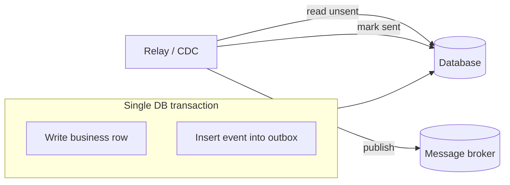

# Outbox & Inbox Pattern

## Concept

- The **dual-write problem**: a service often must do two things atomically - **update its database** and **publish an event/message** (e.g., save an order *and* emit `OrderPlaced`). But the database and the message broker are two separate systems with no shared transaction. If the DB commit succeeds and the publish fails (or vice versa), state and events diverge - a lost or phantom event.
- The **Outbox Pattern** solves the *publishing* side: instead of writing to the DB and then publishing, the service writes the event into an **outbox table in the same database transaction** as the business change. A separate **relay** process reads the outbox and publishes to the broker, marking rows as sent. Because the business write and the outbox write share one ACID transaction, they're atomic - the event is guaranteed to be recorded if and only if the business change committed.
- The **Inbox Pattern** solves the *consuming* side: a consumer records each processed message's ID in an **inbox table** (in the same transaction as its side effect) so that redelivered duplicates are detected and skipped - durable, transactional idempotency (topic 22).

## Problem It Solves

- Guarantees **atomicity between state change and event publication** without distributed transactions - the single most common correctness bug in event-driven systems.
- Ensures **at-least-once** event delivery: the event is durably stored before any publish attempt, so a crash after commit but before publish is recovered when the relay retries.
- Combined with the inbox (or any idempotency mechanism), it yields **effectively-once** processing end to end: produce reliably (outbox) + deduplicate on consume (inbox).
- Decouples the business transaction's latency from broker availability - the broker can be down and events still aren't lost.

## Trade-offs

- **Reliability vs. added machinery**: you add an outbox table, a relay process (or CDC pipeline), and an inbox table; more moving parts than a naive publish.
- **Latency**: events are published after the relay polls/tails the outbox, adding a small delay versus publishing inline.
- **Ordering & duplicates**: the relay typically gives at-least-once with best-effort ordering; consumers still must be idempotent (the inbox handles this).
- **Outbox cleanup**: sent rows must be pruned/archived or the table grows unbounded (ties to data lifecycle, topic 34).
- **Relay implementation choice**: polling the outbox is simple but adds load and latency; tailing the DB log via **Change Data Capture** (Phase 4) is more efficient and lower-latency but more complex to operate.

## Examples

- **Order service**
  - In one transaction: insert the `orders` row *and* insert an `OrderPlaced` row into `outbox`. The transaction commits atomically. A relay (or Debezium CDC) reads new outbox rows and publishes `OrderPlaced` to Kafka, then marks them sent. Payment and Shipping consume it.
- **CDC-based relay**
  - Instead of a polling relay, Debezium tails the database's WAL and streams outbox inserts directly to Kafka - no polling, near-real-time, and no extra read load on the DB.
- **Inbox dedup**
  - The Payment consumer, in the same transaction as recording the charge, inserts the message ID into `inbox`; a redelivered duplicate hits a unique-constraint violation and is safely skipped.
- **Interview framing**
  - The moment a design says "update the DB and publish an event," name the dual-write problem and reach for the outbox pattern (relay or CDC), paired with consumer idempotency/inbox. This is a hallmark of someone who has built real event-driven systems and is high Staff-level signal.
