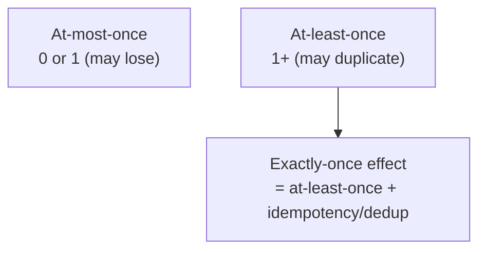

# Exactly-Once vs. At-Least-Once Delivery

## Concept

- **Delivery semantics** describe what guarantee a messaging system gives about how many times a message is processed. There are three:
  - **At-most-once** — each message is delivered zero or one time. No retries; messages can be **lost** on failure. Fast, simplest, lossy. (Fire-and-forget metrics where loss is acceptable.)
  - **At-least-once** — each message is delivered one or more times. Never lost, but can be **duplicated** (a consumer crashes after doing the work but before acking, so it's redelivered). The practical default for reliable systems.
  - **Exactly-once** — each message's *effect* happens once and only once: no loss, no duplicates. The ideal — and the hardest, because it cannot be achieved by delivery alone.
- The crucial insight: **true exactly-once *delivery* is impossible** over an unreliable network (you can't distinguish a lost message from a lost acknowledgment). What's achievable is **exactly-once *processing/effect***, built by combining **at-least-once delivery** with **idempotent consumers** (topic 22) or **deduplication**.

## Problem It Solves

- Forces an explicit, correct choice about the failure behavior of every async link instead of vaguely hoping messages "just arrive once."
- Names the standard, achievable recipe for correctness: **at-least-once delivery + idempotent processing = exactly-once effect** — the pattern behind reliable payments, order processing, and event pipelines.
- Clarifies why duplicates are not a bug to be eliminated at the transport layer but a reality to be handled at the application layer.

## Trade-offs

- **At-most-once** — lowest latency and complexity, but silent data loss; acceptable only when occasional loss is harmless (some telemetry, best-effort notifications).
- **At-least-once** — no loss, but consumers **must** be idempotent or tolerate duplicates; this is where most reliable systems live.
- **Exactly-once effect** — strongest correctness, but costs a dedup/idempotency store (processed-IDs table, idempotency keys) with retention management, plus the atomicity of "record processed + perform effect" (the inbox pattern, topic 36).
- **Framework "exactly-once" caveats** — Kafka's transactional/exactly-once support works **within Kafka** (consume→process→produce in one transaction); it does **not** automatically extend to external side effects like charging a card or calling a third-party API — those still need application-level idempotency.
- **Cost of dedup at scale** — tracking every processed message ID has storage and lookup cost; TTLs and bloom filters help.

## Examples

- **At-least-once + idempotency (the standard)**
  - A payment consumer reads "charge order #42" possibly twice; an idempotency key ensures the second attempt returns the original charge rather than double-charging — exactly-once *effect* from at-least-once *delivery*.
- **Kafka exactly-once (scoped)**
  - A stream job reads from topic A, transforms, and writes to topic B inside a Kafka transaction, so a crash doesn't double-produce to B. But if the same job also emails a user, that email is **not** covered — it needs its own idempotency.
- **Dedup window**
  - A consumer keeps processed message IDs in Redis with a TTL covering the max redelivery window; duplicates within the window are dropped.
- **At-most-once by choice**
  - High-volume click metrics where losing 0.01% is irrelevant — skip retries to maximize throughput.
- **Interview framing**
  - State the guarantee explicitly and the recipe: "I'll use at-least-once delivery with idempotent consumers to get exactly-once *effect* — true exactly-once delivery isn't possible over the network." Correctly noting that Kafka's exactly-once doesn't cover external side effects is a strong distinguishing detail.
