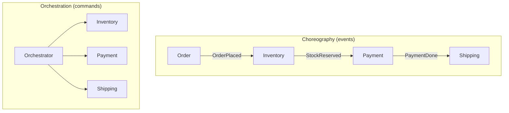

# Choreography vs. Orchestration

## Concept

- When a business process spans multiple services (place order → reserve inventory → charge payment → arrange shipping), there are two ways to coordinate them:
  - **Choreography** — **decentralized**. Each service reacts to events and emits its own events; there is no central coordinator. Order emits `OrderPlaced`; Inventory hears it, reserves stock, emits `StockReserved`; Payment hears that, charges, emits `PaymentCompleted`; and so on. The workflow is an emergent property of who-listens-to-what.
  - **Orchestration** — **centralized**. A dedicated **orchestrator** (a workflow service/engine) explicitly commands each step in sequence: it tells Inventory to reserve, waits, tells Payment to charge, waits, tells Shipping to ship — and handles failures/compensation centrally. The workflow lives in one place.
- This is the coordination axis underneath the **Saga pattern** (Phase 4): a saga can be implemented either way. Choreography ≈ event-driven sagas; orchestration ≈ orchestrator-driven sagas.

## Problem It Solves

- Both coordinate a multi-step, multi-service workflow with no shared transaction, maintaining consistency across services via events/commands and compensation rather than a distributed transaction (Phase 4).
- **Choreography** maximizes decoupling and autonomy: services don't know about a central brain, and adding a new reactor (e.g., a fraud-check service that also listens to `OrderPlaced`) requires no changes to existing services.
- **Orchestration** makes the workflow **explicit, visible, and centrally controllable**: the full sequence, its current state, retries, timeouts, and compensation logic live in one auditable place.

## Trade-offs

- **Choreography: decoupled but hard to see** — no single place shows "what is the order flow?"; the logic is smeared across event subscriptions. Debugging, monitoring, and reasoning about end-to-end state are hard, and **cyclic event chains** can emerge accidentally.
- **Orchestration: visible but coupled/centralized** — the orchestrator knows about every service (more coupling) and is a critical component that can become a complex "god service" or a bottleneck/SPOF if not built carefully.
- **Failure handling** — orchestration centralizes compensation (clear saga rollback logic); choreography spreads it across services that must each emit and handle compensating events (e.g., `PaymentFailed` → Inventory releases stock).
- **Evolution** — choreography eases adding consumers; orchestration eases changing the *sequence* (edit one workflow definition vs. rewiring many event handlers).
- **Tooling** — orchestration is well-served by workflow engines (Temporal, AWS Step Functions, Camunda) that provide durable state, retries, and visibility; choreography leans on a solid event backbone (Kafka) and good distributed tracing.

## Examples

- **Choreographed order flow**
  - Services react to a shared event stream. Adding `LoyaltyPoints` that also listens to `PaymentCompleted` is a zero-touch change to existing services — but answering "why is order #42 stuck?" means tracing events across five services.
- **Orchestrated order flow**
  - A Temporal workflow encodes the exact steps, retries each with backoff, and on payment failure runs compensations (release inventory) in defined order. The whole saga's state is queryable in one place.
- **Hybrid (common in practice)**
  - High-level cross-domain steps are orchestrated for visibility and control; within a domain, services choreograph via events for loose coupling.
- **Rule of thumb**
  - Few steps, high autonomy, easy-to-add reactors → choreography. Complex sequences, strong need for visibility/auditing, intricate compensation → orchestration (use a workflow engine).
- **Interview framing**
  - When a design has a multi-service workflow, name the axis and pick deliberately: "I'd orchestrate the checkout saga with a workflow engine for visibility and centralized compensation, while letting analytics/loyalty choreograph off the same events." Tying it back to sagas and compensation shows you understand distributed consistency, not just message passing.
