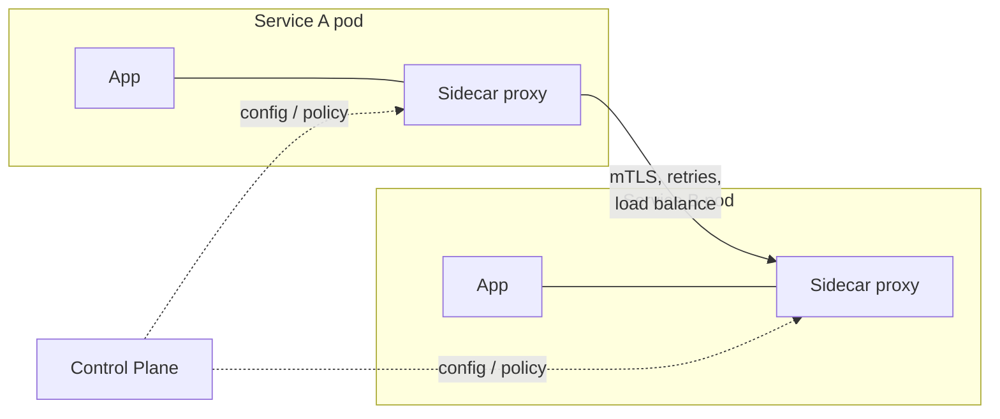

# Service Mesh

## Concept

- A **service mesh** moves cross-cutting network concerns — mTLS, retries, timeouts, load balancing, circuit breaking, and telemetry — *out* of application code and into a dedicated infrastructure layer.
- It works by injecting a **sidecar proxy** (e.g., Envoy) next to every service instance. All inbound/outbound traffic flows through the sidecar, which enforces policy.
- The **data plane** is the fleet of sidecars carrying traffic; the **control plane** (e.g., Istio, Linkerd) configures them centrally — you declare policy once, it applies everywhere.
- The point: every service gets consistent security, resilience, and observability without each team re-implementing it in a different language and getting it subtly wrong.

## Problem It Solves

- In a large microservice fleet, every service needs the same things — mutual TLS, retries with budgets, timeouts, circuit breaking, metrics, distributed tracing. Re-coding these per language is wasteful and inconsistent.
- Centralizes **zero-trust networking**: automatic mTLS between all services without app changes.
- Gives uniform **golden-signal telemetry** (latency, traffic, errors, saturation) for free, since all traffic passes through proxies.
- Enables **traffic management** — canary splits, fault injection, mirroring — declaratively at the platform level.

## Trade-offs

- **Uniformity vs. complexity** — a mesh is a powerful but heavy distributed system of its own; it adds significant operational and cognitive load.
- **Latency & resource overhead** — every hop now passes through two extra proxies, adding latency and CPU/memory per pod.
- **Debugging surface** — failures can now originate in the mesh config, not just your code.
- **When it's overkill** — for a handful of services, library-based resilience (e.g., a shared client lib) or an API gateway (topic 7) is simpler. Mesh value grows with fleet size.
- **Sidecar vs. sidecar-less** — newer ambient/eBPF approaches reduce per-pod overhead but are less mature.

## Examples

- **mTLS everywhere**
  - Istio issues and rotates certificates; service-to-service traffic is encrypted and authenticated with no code change.
- **Resilience as policy**
  - Declare "retry up to 2 times, 100 ms timeout, eject a host after 5 consecutive 5xx" in YAML; it applies to all callers of a service.
- **Progressive delivery**
  - Shift 5% of traffic to v2, watch error rates in mesh telemetry, then ramp — without touching application code.
- **Mesh vs. gateway**
  - The API gateway (topic 7) handles **north-south** traffic (clients → system); the mesh handles **east-west** traffic (service → service). Many architectures use both.
- **Interview framing**
  - Reach for a mesh when you have many services and need uniform security/observability; otherwise note that it's premature and a gateway plus client-side resilience suffices.
