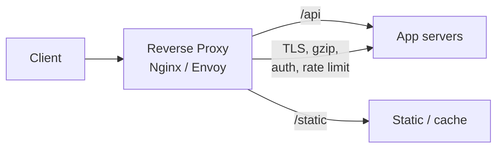

# Reverse Proxy

## Concept

- A **reverse proxy** sits in front of one or more backend servers and forwards client requests to them, returning the backend's response as if the proxy itself served it.
- "Reverse" because it proxies on behalf of the **server** (hiding the backends), unlike a forward proxy which proxies on behalf of the **client** (hiding the user).
- It is a single, controllable choke point where you can centralize TLS termination, caching, compression, request routing, header manipulation, authentication, and rate limiting.
- A load balancer is one *use* of a reverse proxy; reverse proxies do more (caching, routing, security) and may front a single server.

## Problem It Solves

- Centralizes cross-cutting edge concerns so backends stay simple and uniform.
- **TLS termination**: decrypt once at the edge; backends speak plain HTTP internally.
- **Caching**: serve cacheable responses without hitting the app (topic 16 in Phase 2).
- **Routing**: send `/api` to the app, `/static` to a file store, `/auth` to an identity service - by path or host.
- **Security**: hide backend topology, enforce rate limits and WAF rules, strip dangerous headers.
- **Compression & buffering**: gzip/brotli responses and absorb slow clients so app threads aren't tied up.

## Trade-offs

- **Centralization vs. SPOF**: a powerful single point that must be made redundant.
- **Extra hop**: adds a small latency and another component to operate and monitor.
- **Config complexity**: routing/rewrite rules can become intricate and hard to reason about.
- **Reverse proxy vs. API gateway**: a gateway (topic 7) is a specialized reverse proxy with API-specific features (auth, quotas, request transformation, developer portal); a plain reverse proxy is lower-level and more general.
- **TLS termination vs. end-to-end encryption**: terminating at the edge means internal traffic is plaintext unless you re-encrypt (or use a mesh, topic 4).

## Examples

- **Nginx as the canonical reverse proxy**
  - Terminates TLS, serves static files, gzip-compresses, caches, and `proxy_pass`es dynamic requests to upstream app servers.
- **Edge routing**
  - One hostname, many backends: `shop.example.com/api → orders service`, `/img → object storage`, `/ → SSR frontend`.
- **Protecting the origin**
  - Rate limit per IP, block bad user agents, and add security headers before requests ever reach the app.
- **Forward vs. reverse**
  - A corporate forward proxy filters employees' outbound web traffic; a reverse proxy protects and fronts your servers. Same mechanism, opposite direction.
- **Interview framing**
  - Put a reverse proxy at the edge for TLS, caching, and routing; note it's the natural home for rate limiting and the place an LB or gateway plugs in.
