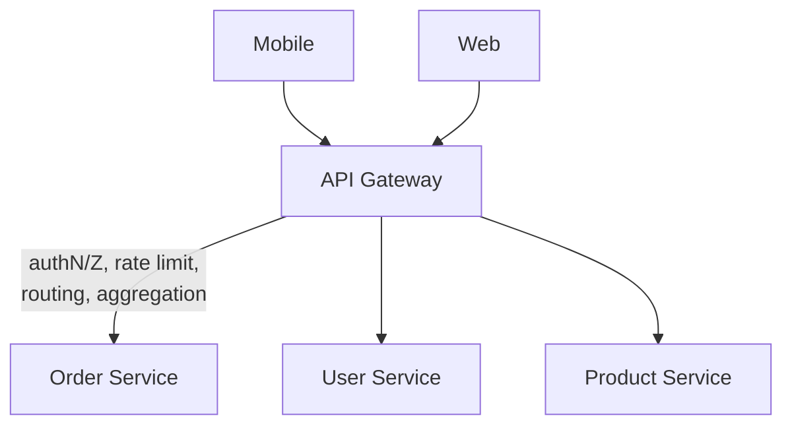

# API Gateway

## Concept

- An **API gateway** is the single entry point for all client traffic into a microservices system. It is a specialized reverse proxy that adds **API-aware** features on top of routing.
- It centralizes concerns that would otherwise be duplicated in every service: authentication/authorization, rate limiting and quotas, request/response transformation, API key management, versioning, and aggregation.
- It decouples clients from the internal service topology: clients call one stable API; the gateway routes to whichever services (which can be split, merged, or moved) fulfill it.
- It handles **north-south** traffic (client ↔ system). For service-to-service (**east-west**) concerns, a service mesh (topic 4) is the counterpart.

## Problem It Solves

- Without a gateway, every service must independently implement auth, rate limiting, and TLS - inconsistently and in different languages.
- Gives clients one endpoint and one auth scheme instead of N service URLs.
- **Aggregation/composition**: one client request fans out to several services and the gateway stitches the responses, cutting round trips on slow networks (related: BFF, topic 29).
- **Protocol translation**: external REST/JSON ↔ internal gRPC.
- **Cross-cutting policy**: centralize quotas, API keys, request validation, and observability at the edge.

## Trade-offs

- **Centralization vs. bottleneck/SPOF**: must be horizontally scaled and made highly available, or it gates the whole system.
- **Convenience vs. coupling**: putting business logic in the gateway turns it into a new monolith; keep it to cross-cutting concerns only.
- **Latency**: an extra hop; aggregation can help or hurt depending on fan-out.
- **One gateway for all clients vs. BFF**: a single general-purpose gateway can become a lowest-common-denominator API; a **Backend-for-Frontend** per client type (web, mobile) avoids over/under-fetching.
- **Operational ownership**: a shared gateway needs a clear owner or it becomes a contested chokepoint.

## Examples

- **Edge responsibilities**
  - Validate JWT, enforce 1000 req/min per key, route `/orders/*` to the order service, translate REST→gRPC, emit traces and metrics.
- **Response aggregation**
  - Mobile home screen needs profile + recent orders + recommendations; the gateway (or BFF) calls three services in parallel and returns one payload.
- **Implementations**
  - Managed: AWS API Gateway, Google Apigee, Kong, Azure API Management. Self-hosted: Kong, Tyk, Envoy-based gateways, Nginx.
- **Gateway vs. mesh vs. reverse proxy**
  - Reverse proxy: general edge proxying. Gateway: API-aware north-south edge. Mesh: east-west service-to-service policy. Large systems use all three.
- **Interview framing**
  - Place an API gateway at the front of a microservices design for auth, rate limiting, and routing; mention BFFs when web and mobile have very different data needs.
