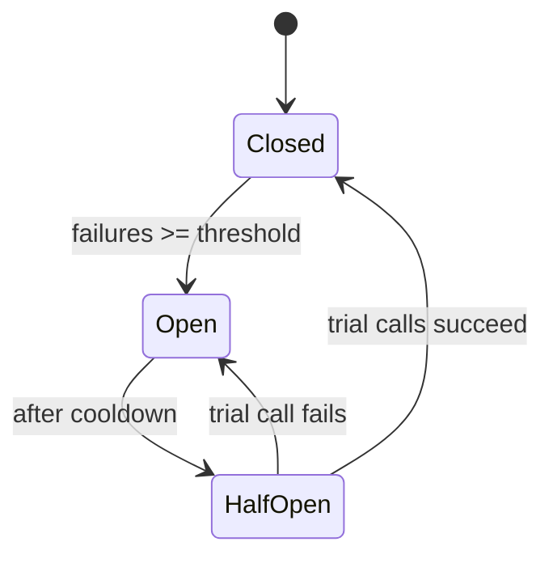

# Circuit Breaker

## Concept

- A **circuit breaker** is a resilience pattern that stops a service from repeatedly calling a downstream dependency that is failing, giving it time to recover and protecting the caller from wasting resources on doomed calls.
- It wraps a remote call and tracks failures. Like an electrical breaker, it has three states:
  - **Closed**: calls flow normally; failures are counted.
  - **Open**: the failure threshold was crossed; calls **fail fast** immediately without hitting the dependency.
  - **Half-open**: after a cooldown, a few trial calls are allowed; success closes the breaker, failure re-opens it.
- The goal is to **fail fast** and avoid the cascading failure where a slow dependency exhausts the caller's threads/connections and takes the caller down too.

## Problem It Solves

- A failing or slow dependency, called naively, ties up caller threads waiting on timeouts. Under load this exhausts the caller's resources and the failure **cascades** upstream.
- The breaker converts slow failures into fast failures, freeing resources and letting the caller serve a fallback or a clean error.
- It gives the struggling dependency breathing room instead of hammering it with retries while it's down (compounding the outage - see retry storms, Phase 4).
- It improves overall system stability and user-perceived latency during partial outages.

## Trade-offs

- **Fail fast vs. false trips**: too sensitive a threshold opens on transient blips and reduces availability unnecessarily; too lax leaves it closed during a real outage.
- **Fallback design**: failing fast is only useful if you have a sensible fallback (cached/stale data, default response, degraded feature) or a clean error path.
- **Per-dependency tuning**: thresholds, windows, and cooldowns must be set per dependency and per traffic pattern; defaults rarely fit.
- **Visibility**: an open breaker must be observable (metrics/alerts) or you mask a real outage as "working."
- **Interaction with retries & timeouts**: breakers must be combined with sane timeouts and bounded retries; together with bulkheads (Phase 4) they form the core resilience toolkit.

## Examples

- **Payment gateway down**
  - After 50% of calls fail in 10 s, the breaker opens; checkout immediately shows "payment temporarily unavailable" instead of 30 s spinners, and the payment provider isn't flooded while recovering.
- **Graceful degradation**
  - Recommendations service is slow → breaker opens → page renders without the recommendations carousel rather than blocking the whole page.
- **Libraries**
  - Resilience4j (Java), Polly (.NET), Hystrix (legacy), or built into a service mesh (topic 4) as outlier detection.
- **Tuning knobs**
  - Failure-rate threshold, sliding-window size, minimum call volume, open-state duration, number of half-open trial calls.
- **Interview framing**
  - Whenever a design makes a synchronous call to a flaky dependency, mention circuit breaker + timeout + bounded retry + fallback as the resilience bundle. This is strong production signal.
