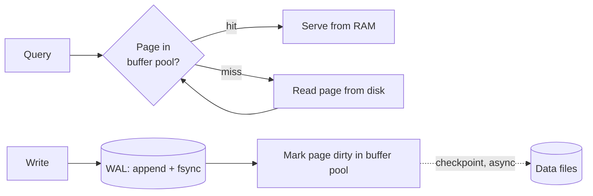

# Database Internals

## Concept

- "Database internals" is the machinery beneath SQL: how a database **durably stores** data, **reads** it efficiently, and keeps it **consistent under concurrency and crashes**.
- The core building blocks:
  - **Pages**: the database reads/writes the disk in fixed-size blocks (commonly 8 KB/16 KB), not individual rows. The unit of I/O and caching.
  - **Buffer pool**: an in-memory cache of recently used pages. Most reads hit RAM; cold reads pay disk latency.
  - **Write-Ahead Log (WAL)**: every change is first appended to a sequential log and fsynced *before* the data pages are updated. This is what makes commits **durable** and crash recovery possible.
  - **MVCC (Multi-Version Concurrency Control)**: readers see a consistent snapshot without blocking writers, by keeping multiple row versions.
  - **The storage engine**: the component that lays out rows on pages and serves them (B-Tree or LSM-Tree; see topic 30).
- Understanding these explains *why* indexes, isolation levels, and replication behave the way they do.

## Problem It Solves

- **Durability without slow random writes**: appending sequentially to the WAL is fast; flushing data pages can be deferred and batched. A crash replays the WAL to recover committed changes.
- **Speed**: the buffer pool turns most queries into memory reads.
- **Concurrency**: MVCC lets many readers and writers proceed without a global lock, which is the basis of isolation levels (topic 11).
- **Crash recovery**: WAL + checkpoints reconstruct a consistent state after a power loss.

## Trade-offs

- **WAL durability vs. latency**: `fsync` on every commit is safe but slow; group commit and `synchronous_commit` settings trade a tiny durability window for throughput.
- **Buffer pool size**: bigger means more cache hits but competes with other memory; the working set should ideally fit.
- **MVCC vs. bloat**: old row versions must be cleaned up (vacuum/compaction); neglect causes table bloat and slowdowns.
- **Page-level I/O vs. row size**: wide rows or many small updates waste page space and cause write amplification.
- **In-place update (B-Tree) vs. append (LSM)**: a fundamental engine choice covered in topic 30.

## Examples

- **PostgreSQL**
  - Heap tables + B-Tree indexes, WAL for durability and replication, MVCC with row versions cleaned by `VACUUM`, an 8 KB page size, and a shared-buffers buffer pool.
- **Why a crash doesn't lose committed data**
  - Commit returns only after the WAL record is fsynced. On restart, the engine replays the WAL from the last checkpoint, re-applying committed changes and discarding uncommitted ones.
- **Why a full table scan is slow**
  - It reads every page from disk into the buffer pool. An index lets the engine touch only the pages holding matching rows (topic 10).
- **MVCC in action**
  - A long-running report reads a consistent snapshot taken at its start, even as concurrent writers modify rows - readers don't block writers and vice versa.
- **Interview framing**
  - When asked "how does the DB guarantee durability?" answer "WAL: append + fsync before acking the commit, with checkpoints flushing pages asynchronously." When asked about read speed, talk buffer pool and indexes.
