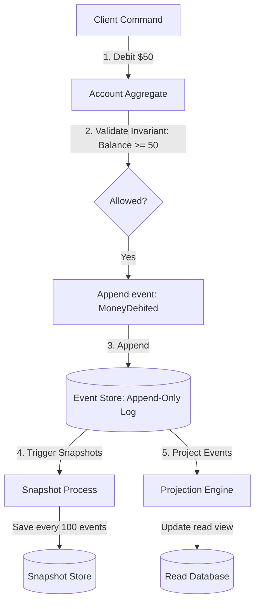

# Event Sourcing

## Concept

- **Event Sourcing** is an architectural pattern in which all state changes of an application are captured and stored as a chronological sequence of immutable, append-only events in an **Event Store**.
- Traditional databases only store the *current state* of a record, overwriting previous values (e.g., updating a user's address deletes the old address). Event Sourcing preserves the entire history of how that state was reached.
- Core mechanics:
  - **Events**: Immutable facts about something that happened in the past (e.g., `AccountOpened`, `MoneyDeposited`, `AddressUpdated`).
  - **Aggregate Reconstruction (Replay)**: To find the current state of an entity, the system starts with an empty state and replays all events associated with that entity ID in sequential order.
  - **Snapshots**: If an entity has thousands of events, replaying them on every read is too slow. The system periodically (e.g., every 100 events) saves a snapshot of the current state. Read operations load the latest snapshot and replay only the events that occurred after it.
  - **Projections (Read Models)**: Background workers read the event stream and project the events into read-optimized views (e.g., updating a search index or relational database), matching the CQRS pattern (topic 9).

## Problem It Solves

- **Silent History Erasure**: In traditional CRUD, you lose the context of *how* a state changed. Event Sourcing records every business action, providing a perfect audit trail out of the box.
- **Write Contention**: Appending to a log is a sequential disk operation, which is much faster than performing random updates in a relational database with indexes, page locks, and transaction tables.
- **Time Travel**: Allows developers to reconstruct the state of the entire system (or a single entity) at any exact moment in time, simplifying debugging and historical reporting.

## Trade-offs

- **Pros**:
  - 100% audit accuracy; no logs are deleted.
  - High write performance.
  - Ability to generate completely new read-model databases retrospectively by replaying the event log from genesis.
- **Cons**:
  - **Read path complexity**: Reconstructing aggregates from logs requires snapshot coordination.
  - **Schema Evolution (Versioning)**: Events are stored forever. If the schema of `UserRegistered` changes over 5 years (e.g., splitting a `name` field into `firstName` and `lastName`), old events must still be readable. The system requires **upcasters** (logic that transforms old event JSON schemas to new formats on the fly during load).
  - **Eventual consistency**: Projections are processed asynchronously, meaning the read models can lag behind the write store.

## Examples

- **Banking & Accounting**: Ledgers track every transaction (credits/debits). The current account balance is a projection computed by summing the transactions.
- **Version Control (Git)**: Git stores a history of commits (diff events). Your local directory is a projection of the files after applying those commits sequentially.
- **EventStoreDB / Axon Framework**: Databases and frameworks built specifically to support event sourcing.
- **Interview framing**:
  - When designing audit-critical or ledger-like systems: *"For a core banking wallet or a multi-step shipping log, I will use **Event Sourcing**. Instead of storing the current state in a SQL table, we will append immutable events to an **Event Store** (like EventStoreDB or PostgreSQL with an append-only schema). We will utilize **snapshotting** to keep read latency sub-millisecond and leverage CQRS projections to update read-optimized views. To handle schema changes over time, I will design a pipeline of **upcasters** to adapt legacy event schemas during replay."*
