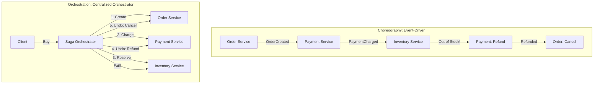

# Saga Pattern

## Concept

- **Saga Pattern** is a design pattern used to manage consistency and transactions across multiple microservices, where each microservice maintains its own local database.
- Traditional ACID transactions (like 2PC) block databases while waiting for confirmation, which hurts scaling. Sagas solve this by splitting a distributed transaction into a sequence of **local transactions**.
- Each local transaction updates the database of a single service. If a step fails, the Saga coordinates a series of **Compensating Transactions** that run backward to undo the changes made by the previous steps.
- There are two primary architectural styles for coordinating Sagas:

### Choreography (Decentralized Coordination)

- Services publish events and subscribe to events from other services.
- Each service executes its local transaction and publishes a new event, which triggers the next service.
- **Best for**: Simple workflows with few participants.

### Orchestration (Centralized Coordination)

- A central orchestrator (Saga Manager) coordinates the execution.
- The orchestrator sends instructions to services, listens to success/failure events, and decides whether to proceed to the next step or execute compensating rollback tasks.
- **Best for**: Complex, multi-step workflows.

## Problem It Solves

- **Lack of distributed ACID**: Microservices should not share a database or block resources using 2PC. Sagas allow services to achieve **eventual data consistency** without database-level coupling.
- **Handling transient failures**: Safely handles business failures (e.g., credit card declined or item out of stock) halfway through a multi-system business flow.

## Trade-offs

- **Pros**:
  - Highly scalable; no distributed locks or thread blocking.
  - Keeps microservices decoupled.
- **Cons**:
  - **Complexity of rollbacks**: Compensating transactions must be designed to handle failures during rollback themselves (must be idempotent).
  - **Lack of Transaction Isolation**: Sagas lack the "I" in ACID. Because local transactions commit immediately, intermediate steps are visible to other requests. This can lead to anomalies:
    - *Dirty Reads*: A client reads a reserved seat that is later cancelled during a rollback.
    - *Lost Updates*: One saga updates an account balance, which is overwritten by a parallel rollback.
  - **Mitigation**: Systems use *Semantic Locks* (flagging records as "Pending Rollback" or "In-Flight") to block other operations during the saga.

## Examples

- **E-Commerce Checkout Workflow**:
  1. **Order Service**: Creates an order in `PENDING` state.
  2. **Payment Service**: Authorizes payment. (Compensating step: Void Authorization).
  3. **Inventory Service**: Reserves items. (Compensating step: Release Reserved Items).
  4. **Shipping Service**: Books delivery.
  5. **Order Service**: Updates order state to `APPROVED`.
- **Saga Orchestrator Engines**: **Temporal.io**, **Cadence**, and **AWS Step Functions**.
- **Interview framing**:
  - When coordinating workflows across microservices (e.g., flight + hotel bookings): *"To enforce business transactions without blocking database threads (avoiding 2PC), I will use the **Saga Pattern**. For workflows with more than three steps, I choose **Orchestration** using an engine like **Temporal**, which manages the saga state machine, timeout retries, and compensation routes. I will design all compensating transactions to be **idempotent** to ensure they can be safely retried during recovery."*
