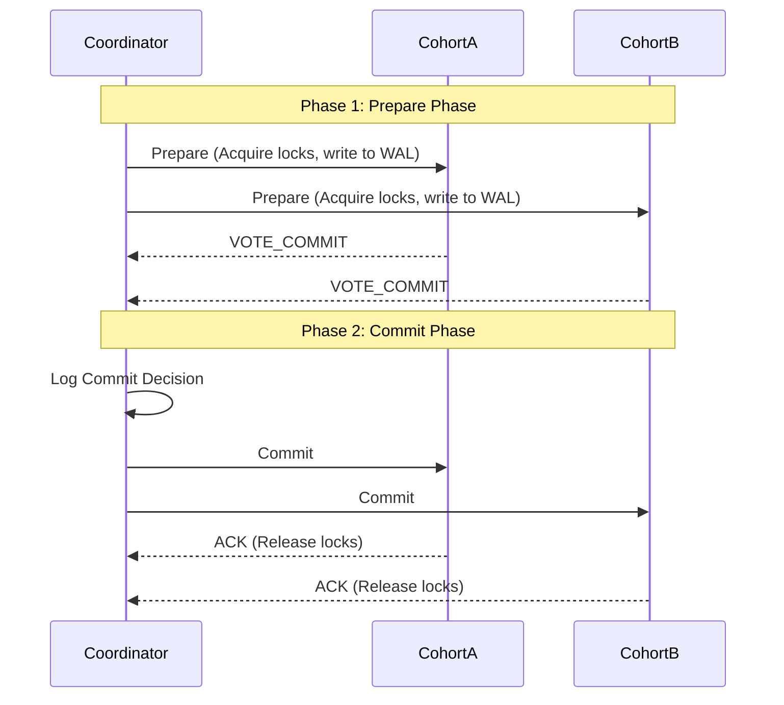

# Distributed Transactions

## Concept

- A **Distributed Transaction** is a transaction that updates data across multiple physical databases, partitions, or microservices, while guaranteeing ACID properties (Atomicity, Consistency, Isolation, Durability) across the entire system.
- To enforce all-or-nothing atomicity across nodes, databases use **atomic commitment protocols**:

### Two-Phase Commit (2PC)

2PC relies on a central coordinator node that manages the voting and execution process across cohort nodes:

1. **Prepare Phase**:
   - The coordinator sends a `PREPARE` request to all cohorts.
   - Cohorts execute the query locally up to the commit point, allocate resources, write undo/redo logs, acquire exclusive locks on the rows, and reply with `VOTE_COMMIT` or `VOTE_ABORT`.
2. **Commit Phase**:
   - If all cohorts vote `VOTE_COMMIT`, the coordinator writes the decision to its disk and sends a `COMMIT` message. Cohorts commit the transaction, release their locks, and reply with `ACK`.
   - If any cohort votes `VOTE_ABORT` (or fails to respond), the coordinator sends `ROLLBACK`. Cohorts roll back the transaction and release locks.
- **The Coordinator Lockup Problem**: If the coordinator crashes after cohorts have voted `VOTE_COMMIT` but before it transmits the `COMMIT` message, the cohorts must block and hold locks indefinitely. They cannot unilaterally abort (since others may have committed) or commit (since others may have aborted).

### Three-Phase Commit (3PC)

- 3PC addresses the coordinator lockup problem by splitting the commit phase into two stages: `Pre-Commit` and `Do-Commit`, and introducing timeouts.
- **The Problem**: 3PC assumes a fail-stop model where nodes fail but network partitions do not happen. In real-world networks with partitions, 3PC can easily result in data divergence. Thus, it is rarely implemented.

### Consensus-Backed Transactions

- Modern databases (Spanner, CockroachDB) resolve the coordinator failure problem by replicating both the coordinator and the cohorts using **consensus groups** (Paxos or Raft, topic 16).
- If a coordinator node crashes, the Paxos group elects a new leader coordinator, which recovers the state machine and completes the 2PC protocol safely.

## Problem It Solves

- **Cross-partition consistency**: Enforces strict ACID guarantees when data is sharded across different database servers (e.g., deducting money from account $A$ on Server 1 and adding it to account $B$ on Server 2).

## Trade-offs

- **Pros**:
  - Provides **strong consistency** (Linearizability / Serializability).
  - Simple programming model; the database guarantees safety.
- **Cons**:
  - **Latency**: Multiple roundtrips over the network are required to commit.
  - **Blocked throughput**: Cohorts hold exclusive database locks from the start of Phase 1 until the end of Phase 2. This creates massive lock contention and decreases system capacity under load.
  - **Single point of failure**: Classic 2PC depends entirely on the availability of the coordinator.

## Examples

- **XA Transactions**: The standard protocol specification supported by JDBC and enterprise databases (MySQL, PostgreSQL) to execute 2PC across distinct systems.
- **Google Spanner / CockroachDB**: Databases that implement 2PC to perform multi-shard transactions, using Raft/Paxos underneath to make the coordinator and cohorts fault-tolerant.
- **2PC vs. Sagas**:
  - **2PC** is synchronous, blocks locks, and guarantees strict isolation, but is slow and scales poorly.
  - **Sagas** (topic 11) are asynchronous, do not hold locks, and scale well, but lack isolation (exposing intermediate states).
- **Interview framing**:
  - When asked how to achieve transactional guarantees across distributed stores: *"I will first analyze the scale and throughput requirements. If absolute ACID isolation is required (e.g., ledger accounting), I will use a **consensus-backed 2PC database** like Google Spanner to avoid coordinator lockup. If the business can tolerate eventual consistency and demands high horizontal scale, I will avoid 2PC because of its blocking lock overhead and use the **Saga Pattern** with compensating transactions instead."*
