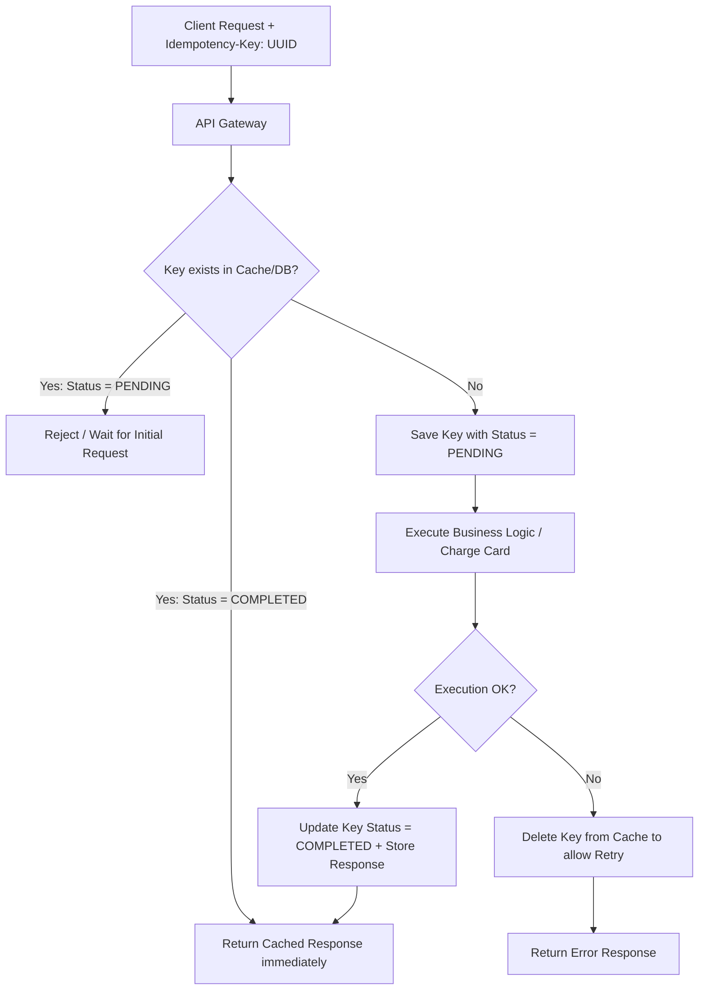

# Idempotency in Distributed Systems

## Concept

- **Idempotency** is the property where an operation can be executed multiple times without changing the system's state beyond the initial execution.
- In distributed systems, network packets are regularly dropped. If a client sends a payment request, the payment succeeds, but the network connection drops before the client receives the response, the client will retry. Without idempotency, this results in **duplicate charges (double billing)**.
- Enforcing idempotency requires three primary techniques:



### 1. Idempotency Keys (The Token Pattern)

- The client generates a unique identifier (UUID) and sends it in the header (e.g., `Idempotency-Key: <UUID>`).
- The server checks an **Idempotency Store** (e.g., Redis or an RDBMS table) before processing:
  - If the key exists with a status of `COMPLETED`, the server returns the cached response directly.
  - If the key exists with `PENDING`, the server rejects the concurrent duplicate.
  - If the key does not exist, the server inserts it in a `PENDING` state, executes the transaction, saves the result, updates the key status to `COMPLETED`, and returns the response.

### 2. Database Unique Constraints

- Relational databases can prevent duplicate records using unique index constraints (e.g., `UNIQUE(user_id, transaction_reference)`).
- If a retried request attempts to insert the same record, the database rejects it with a unique constraint violation error, aborting the transaction.

### 3. State Guarding (State Machine Transition)

- Operations only proceed if the entity is in a valid state:
  ```sql
  UPDATE orders SET status = 'SHIPPED' WHERE id = 42 AND status = 'PAID';
  ```
- If the request is retried, the order status will already be `SHIPPED`. The database updates 0 rows, preventing duplicate processing.

## Problem It Solves

- **At-Least-Once Delivery Side Effects**: Most messaging queues (Kafka, RabbitMQ) only guarantee *At-Least-Once* delivery, meaning messages can be redelivered. Idempotency protects consumers from processing duplicates.
- **Client Timeout Safety**: Allows mobile apps or web clients to aggressively retry failed HTTP requests without risking state corruption.

## Trade-offs

- **Pros**:
  - Prevents financial errors, double-delivery, and database corruption.
  - Decouples client retry logic from business risk.
- **Cons**:
  - **Storage Overhead**: Response payloads must be stored in a database or Redis cache with an appropriate Time-To-Live (TTL) (e.g., 24-72 hours), increasing memory and storage costs.
  - **Concurrency Issues (Race Conditions)**: If two identical requests hit the server at the exact same millisecond, they might both pass the check. Enforcing this requires atomic cache operations (like Redis `SETNX`) or transactional database locks.
  - **Client-Side Dependency**: Relies on clients correctly generating and persisting UUIDs across retries.

## Examples

- **Stripe API**: Accepts a header `Idempotency-Key`. Re-submitting the same key returns the cached payment response.
- **HTTP Methods Specification**:
  - **Idempotent**: `GET`, `PUT`, `DELETE`, `HEAD`, `OPTIONS` (calling them multiple times yields the same state).
  - **Non-Idempotent**: `POST` (usually creates a new resource on every call).
- **Payment Processor Integration**: Mapping a merchant order ID to a payment gateway reference.
- **Interview framing**:
  - When designing transactional systems, payments, or write-heavy APIs: *"To ensure network retries do not trigger duplicate mutations, all write endpoints will be idempotent. I will implement an **Idempotency Filter** using **Redis** with an atomic `SET key value NX PX 86400000` (86400000ms = 24 hours TTL). If Redis returns null, the key is already processing or completed, and we return the cached response. To prevent race conditions, the Redis insertion must be done atomically before any business logic is executed."*
