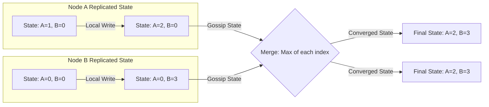

# CRDTs (Conflict-free Replicated Data Types)

## Concept

- A **CRDT** is a distributed data structure designed to be replicated across multiple nodes in a network, where replicas can be updated independently and concurrently without coordination (locks or consensus), and are mathematically guaranteed to converge to the same state when they sync.
- CRDTs form the foundation of active-active multi-region databases and collaborative editing systems.
- There are two primary types of CRDTs:

### 1. State-Based CRDTs (CvRDTs: Convergent Replicated Data Types)

- Nodes send their entire local state to other nodes.
- Replicas merge incoming states using a **merge operator** ($\sqcup$).
- For CvRDTs to converge, the merge operator must form a mathematical **join-semilattice**, satisfying three properties:
  - **Commutative** ($A \sqcup B = B \sqcup A$): Replicas can receive state updates in any order.
  - **Associative** ($(A \sqcup B) \sqcup C = A \sqcup (B \sqcup C)$): Grouping of messages does not affect the outcome.
  - **Idempotent** ($A \sqcup A = A$): Duplicate updates or multi-path delivery do not alter the state.

### 2. Operation-Based CRDTs (CmRDTs: Commutative Replicated Data Types)

- Nodes do not transmit state; they transmit individual execution operations (e.g., `add('item')`, `increment(5)`).
- CmRDTs require that concurrent operations commute (the order in which operations are applied doesn't matter: `add(x)` then `add(y)` results in the same state as `add(y)` then `add(x)`).
- **Prerequisite**: Requires a reliable, causally ordered messaging channel to deliver operations.

### Common CRDT Structures

- **G-Counter (Grow-Only Counter)**: A vector where each entry belongs to a node. Nodes only increment their own index. Merging takes the maximum of each index. Summing all values in the vector yields the counter total.
- **PN-Counter (Positive-Negative Counter)**: Uses two G-Counters: one for increments (P) and one for decrements (N). The counter value is $P - N$.
- **LWW-Element-Set (Last-Write-Wins Set)**: Stores elements in an `Add Set` and a `Remove Set` with timestamps. If an item is in both, the one with the higher timestamp wins.
- **OR-Set (Observed-Remove Set)**: Elements added are tagged with a unique ID. When removed, all tags associated with that element observed by the removing node are added to a tombstone set.

## Problem It Solves

- **Multi-region latency**: Traditional databases require consensus (Raft/Paxos) to write. This introduces cross-region network delay. CRDTs allow local writes to return immediately and resolve conflicts offline.
- **Collaborative sync**: Enables users to edit documents offline (like Google Docs or Figma) and merge changes without overwriting each other's work or requiring a server lock.

## Trade-offs

- **Pros**:
  - High availability and zero latency on writes (local execution).
  - Mathematical guarantee of no conflict resolution errors.
  - Resilience under network partitions.
- **Cons**:
  - **Storage Bloat (Metadata)**: CRDTs require storing identifiers, timestamps, and tombstones for historical updates. This metadata can grow larger than the actual payload data.
  - **Tombstone accumulation**: Deleting elements does not free memory immediately. Deletes remain as tombstone records, requiring complex background cleanup cycles.
  - **Limited Domain Modeling**: Cannot enforce global constraints (e.g., ensuring a bank balance never goes below zero, or booking a limited item inventory) because checking these requires synchronous locks.

## Examples

- **Redis Enterprise**: Uses CRDTs to support Active-Active global database clustering.
- **Figma**: Implements custom CRDTs to synchronize multi-user visual coordinate layout canvas designs.
- **Apple Notes**: Uses CRDTs to resolve typing conflicts across user devices (Mac, iPad, iPhone).
- **Automerge / Yjs**: Open-source JavaScript libraries for building collaborative web apps (like Notion-style editors).
- **Interview framing**:
  - When asked to design a real-time collaborative text editor or a global active-active database: *"To avoid blocking locks and high latency, I will use **CRDTs (Conflict-free Replicated Data Types)**. For a text canvas, I would utilize an **Observed-Remove Set (OR-Set)** or a library like **Yjs** to manage elements. By defining a **join-semilattice** merge operator that is commutative, associative, and idempotent, we ensure that replicas converge to the exact same state without requiring centralized coordination. I will pair this with **delta-state gossiping** to minimize the metadata payload sent over the network."*
