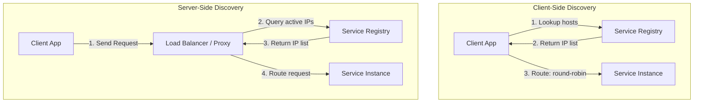

# Service Discovery

## Concept

- In dynamic cloud and containerized environments, service instances are constantly created, destroyed, autoscaled, or relocated, causing their IP addresses and ports to change dynamically.
- **Service Discovery** is the mechanism that allows microservices to dynamically locate and route requests to these transient network endpoints without hardcoding values.
- Core components:
  - **Service Registry**: A centralized database containing the network locations (IP, port) of all active service instances.
  - **Registration**: Service instances register themselves with the registry upon startup.
  - **Health Checking**: The registry or local agents periodically check service health (heartbeats), automatically evicting unhealthy instances.
- There are two primary architectural patterns for service discovery:

### 1. Client-Side Discovery

- The client application queries the Service Registry directly to retrieve the list of available instances.
- The client then runs a local load-balancing algorithm (like round-robin or least-connections) to select one instance and makes the network call.
- **Example**: Netflix Eureka (Registry) coupled with Netflix Ribbon (Client Load Balancer).

### 2. Server-Side Discovery

- The client makes a call to a fixed proxy or load balancer.
- The proxy queries the Service Registry and routes the request to an active instance.
- The client is completely unaware of the individual instance IPs.
- **Example**: AWS Application Load Balancer (ALB) or Kubernetes Services.

## Problem It Solves

- **Static configuration errors**: Eliminates the need to maintain static configuration files of service endpoints, which break during autoscaling or server migrations.
- **Autoscaling integration**: Integrates directly with autoscaling pools, registering new instances within seconds of coming online.

## Trade-offs

- **Client-Side Discovery**:
  - **Pros**: Fewer network hops (direct client-to-host call minimizes latency). Client has full visibility and control over the load-balancing strategy.
  - **Cons**: High coupling. The client application must include registry-specific client libraries. Requires implementing and maintaining libraries for every programming language in use.
- **Server-Side Discovery**:
  - **Pros**: Language-agnostic. Simple client code (standard HTTP/gRPC call).
  - **Cons**: Extra network hop through the proxy (adds latency). The proxy is a potential bottleneck and represents a single point of failure (requires high availability clustering).
- **AP vs. CP Registry**:
  - Registries like **Consul / etcd** are **CP** (Consistency-focused, consensus-backed). They ensure all nodes see the exact same list of instances, but writes block if the registry itself partitions.
  - Registries like **Eureka** are **AP** (Availability-focused). During a partition, nodes can read stale registration lists. AP is often preferred for discovery: routing to a slightly stale IP (which can be handled by client retries) is better than a total registry outage.

## Examples

- **Consul**: A CP service registry using Raft consensus, exposing HTTP and DNS interfaces.
- **Kubernetes DNS & kube-proxy**: Kube-DNS acts as the service registry. When a Service is created, Kubernetes updates internal iptables (managed by kube-proxy) or IPVS on all nodes to route traffic to pod IPs dynamically (Server-Side Discovery).
- **Netflix Eureka**: An AP service registry designed for AWS environments where node failures are common.
- **Interview framing**:
  - When designing dynamic microservice systems: *"To route traffic dynamically without maintaining static IP lists, I will implement **Server-Side Discovery** using **Kubernetes Services**. This keeps our client code thin and language-agnostic. For the registry, I prefer an **AP model** (like Netflix Eureka or Consul with relaxed read constraints) over CP. A stale IP is easily mitigated by client-side retries and circuit breakers, whereas a CP registry write-lockout prevents new nodes from registering during traffic spikes."*
