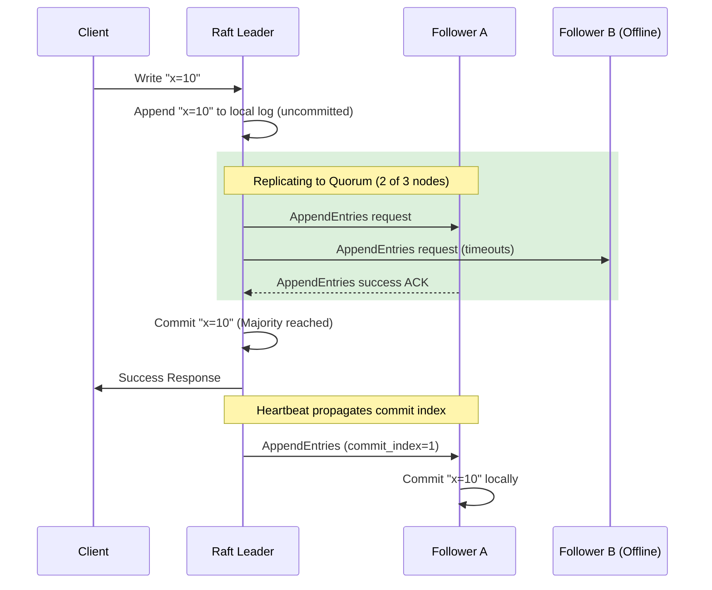

# Consensus Algorithms

## Concept

- **Consensus** is the process of getting a set of independent nodes in a distributed system to agree on a single data value, decision, or sequence of events (a log), even in the presence of network delays, packet loss, or node crashes.
- Consensus is the core mechanism of **Replicated State Machines (RSM)**: if multiple nodes start in the same initial state, apply the exact same sequence of log entries, they will arrive at the exact same final state.
- The two most prominent crash-tolerant consensus algorithms are:

### Paxos

- The classical consensus algorithm designed by Leslie Lamport.
- Roles: *Proposers* (advocate values), *Acceptors* (vote and store state), and *Learners* (read the decided state).
- Executes in two phases:
  - **Phase 1 (Prepare / Promise)**: Proposer sends a proposal number $N$ to a majority of Acceptors. Acceptors promise not to accept proposals numbered less than $N$.
  - **Phase 2 (Accept / Committed)**: If a majority promise, the Proposer sends the proposal value $V$. Acceptors accept it unless they've promised a higher proposal number.
- **Multi-Paxos** optimizes this by electing a stable leader, skipping Phase 1 for subsequent writes to reduce latency.

### Raft

- Designed to be more understandable than Paxos. It decomposes consensus into three distinct sub-problems:
  - **Leader Election**: Nodes are in one of three states: *Leader*, *Follower*, or *Candidate*. If a follower's randomized heartbeat timeout expires, it becomes a candidate, increments the term, votes for itself, and requests votes from peers.
  - **Log Replication**: The leader receives client writes, appends them to its local log, and replicates them to followers.
  - **Commit Safety**: A log entry is committed once it is replicated to a **majority quorum** of nodes. Followers only vote for candidates whose logs are at least as up-to-date as their own, ensuring committed entries are never lost.

### Quorum Mathematics

- To tolerate $F$ node failures, a cluster must consist of at least $N = 2F + 1$ nodes.
- A quorum is defined as any subset containing at least $\lfloor N/2 \rfloor + 1$ nodes. This ensures that any two quorums overlap by at least one node, which must contain the most up-to-date state.

## Problem It Solves

- **Split-brain prevention**: Prevents network partitions from creating two concurrent leaders that write conflicting states.
- **Strong consistency guarantees**: Provides the foundation for building linearizable distributed datastores and coordinate cluster states.

## Trade-offs

- **Pros**:
  - **Absolute Consistency**: Guarantees linearizability; no dirty reads or write loss.
  - **High Fault Tolerance**: Automatic failover and healing as long as a majority of nodes are online.
- **Cons**:
  - **Write Latency**: Every write requires network roundtrips to a majority of nodes.
  - **Throughput Bottleneck**: The leader coordinates all writes sequentially, limiting total write throughput. Cannot scale writes horizontally.
  - **Odd Node Requirement**: Adding nodes increases reliability but degrades write latency (larger quorums require more network chatter).

## Examples

- **etcd**: Uses Raft consensus. Serves as the single source of truth for all Kubernetes configuration and state.
- **ZooKeeper**: Uses ZAB (ZooKeeper Atomic Broadcast) to coordinate configuration and distributed locking for Hadoop and Kafka clusters.
- **CockroachDB**: Splices the database into small key ranges, with each range managed by a separate 3-node Raft consensus group (multi-raft), enabling horizontal SQL scaling with strong ACID.
- **Interview framing**:
  - When coordinating critical metadata, distributed locks, or configuration files: *"For critical cluster metadata or coordination, I will use a **consensus-backed store** like **etcd** running **Raft**. This guarantees strong consistency and safety against split-brain scenarios. However, because consensus requires majority round-trip confirmations, I will never write high-volume transaction data directly to it, reserving it strictly for configuration, coordination, and distributed locks."*
