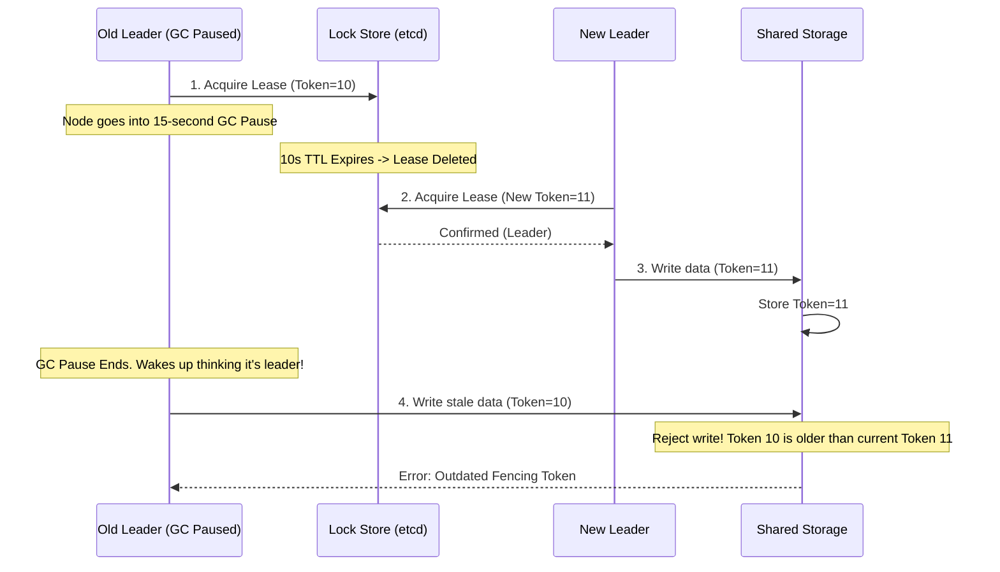

# Leader Election

## Concept

- **Leader Election** is the architectural process of designating a single coordinator node (the "master" or "leader") from a group of nodes to assume responsibility for managing transactions, coordinating jobs, or directing traffic.
- Having a single leader simplifies consistency because it guarantees **single-writer semantics** (eliminating concurrent write conflicts).
- Two main methodologies for electing a leader:

### 1. Consensus-Based Election (Raft / Paxos)

- Election logic is built directly into the consensus algorithm of the cluster.
- Nodes vote for candidates based on term numbers and log completeness (the candidate with the most up-to-date log wins).

### 2. Lease-Based Election (Lock Store)

- The application uses an external, strongly consistent database (etcd, ZooKeeper, Consul) to coordinate leadership.
- Candidates attempt to write an **ephemeral key** (a lease) representing leadership (e.g., `PUT /services/order-leader` with a TTL of 10 seconds).
- The node that successfully writes the key becomes the leader.
- **Heartbeat Refresh**: The leader must periodically renew the lease before the TTL expires. If the leader crashes, the lease expires, the key is automatically deleted by the lock store, and standby nodes race to write the key to claim leadership.

### The Split-Brain Problem and Fencing Tokens

- **Split-Brain** occurs when a leader is temporarily disconnected or paused (e.g., a JVM Garbage Collection pause or network blip), causing standby nodes to assume it is dead and elect a new leader.
- When the old leader wakes up, it is unaware that it has been deposed and attempts to write to shared storage, resulting in data corruption.
- **Fencing Tokens** resolve this:
  - Every leader election increments a monotonic counter (the **Epoch Number** or **Fencing Token**).
  - The lock store attaches this token to the leader lease.
  - When writing to shared storage, the leader must present its token.
  - The storage node checks the token against the highest token it has ever seen. If a write arrives with token 10 but a token 11 write has already succeeded, the storage rejects the token 10 write.

## Problem It Solves

- **Split-Brain Corruption**: Prevents two active coordinators from writing conflicting updates to shared storage.
- **Resource Contention**: Coordinates background jobs (e.g., database backups or cron schedules) so only one server executes the task.

## Trade-offs

- **Consensus-Based (Integrated)**:
  - **Pros**: Highly secure; no external dependencies to manage.
  - **Cons**: Tied to the database engine. If the cluster loses its quorum, it cannot elect a leader and rejects all writes.
- **Lease-Based (External)**:
  - **Pros**: Decouples application business logic from consensus; simple to implement using lock clients.
  - **Cons**: Creates a dependency on an external cluster. If etcd is down, the application cannot run elections.
- **Lease TTL Tuning**:
  - **Short TTL** (e.g., 2s): Fast failover recovery, but highly sensitive to GC pauses, leading to "leader flapping."
  - **Long TTL** (e.g., 30s): Highly stable, but if the leader crashes, the system remains degraded/read-only for 30 seconds before failover occurs.

## Examples

- **Kafka KRaft**: Raft-based controller elections that replace ZooKeeper.
- **Kubernetes Controller Manager**: Uses etcd leases. Only one instance holds the lock lease and processes resource reconciliation loops.
- **Active-Passive Database Failover**: ZooKeeper checks heartbeats of primary database nodes; if the primary fails, it promotes a replica and updates DNS.
- **Interview framing**:
  - When designing master-replica databases, schedulers, or file locking: *"To safely manage single-writer operations, I will implement **lease-based leader election** using **etcd**. To handle split-brain situations caused by network splits or long garbage collection pauses, I will enforce **Fencing Tokens (epoch numbers)** at the storage layer. Any write from a deposed leader with a stale token will be rejected by the storage node."*
