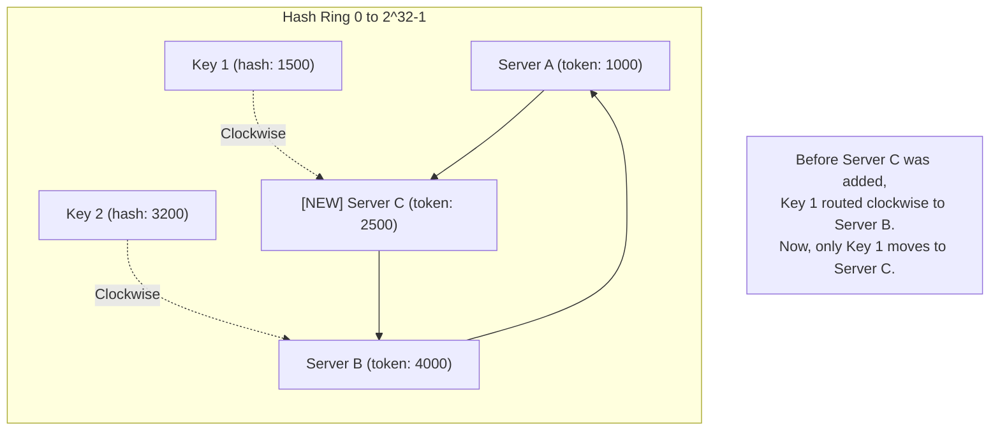

# Consistent Hashing

## Concept

- In traditional partition routing, keys are mapped to servers using the modulo operator:
  $$\text{server} = \text{hash}(\text{key}) \pmod N$$
  Where $N$ is the number of servers.
- **The Problem**: If a server is added or removed, $N$ changes. Consequently, nearly all keys ($90\%+$ in a large cluster) hash to new servers. This triggers a **cache stampede** or requires moving almost the entire database across the network.
- **Consistent Hashing** is a partitioning strategy where changing the number of servers only requires moving $K/N$ keys on average (where $K$ is the total number of keys, and $N$ is the total number of servers).
- How it works:
  - Both keys and server nodes are hashed onto a circular **Hash Ring** (typically spanning $0$ to $2^{32}-1$) using the same hash function (e.g., MurmurHash).
  - To locate the server for a key, map the key's hash value onto the ring, and traverse **clockwise** until you encounter the first server. That server is the owner of the key.
  - **Node Join**: A new server (Node C) is added. It sits between Node A and Node B. Only keys between A and C need to be migrated from Node B to Node C.
  - **Node Leave**: A server (Node B) crashes. All keys previously routed to Node B now route clockwise to Node D. No other nodes are affected.

### Virtual Nodes (Vnodes)

- **The Problem**: Standard consistent hashing results in an uneven distribution of keys. If servers hash close to each other on the ring, one server might own a massive segment of keys while others own very little (hotspots).
- **The Solution**: Instead of mapping a physical server once, map it multiple times (e.g., 256 times) using virtual indices (`Server A-1`, `Server A-2`, `Server A-3`).
- **Benefits**:
  - Keys are distributed much more uniformly across physical nodes.
  - Heterogeneous clusters can assign more virtual nodes to powerful servers and fewer to weaker servers.

## Problem It Solves

- **Cache Storms**: Eliminates the database collapse that occurs when cache nodes scale up/down, causing massive key drops.
- **Database Sharding Downtime**: Allows sharded databases to scale out dynamically without requiring a complete database lock and full partition migration.

## Trade-offs

- **Pros**:
  - Minimal data migration during scaling operations.
  - Uniform load balancing across nodes via Vnodes.
  - Completely decentralized routing; clients or proxies route keys locally.
- **Cons**:
  - **Client Routing Overhead**: Clients or routers must maintain the local hash ring topology map. They need to subscribe to gossip or consensus updates (registry) to keep this map fresh.
  - **Lookup Latency**: Locating a node requires searching the hash ring (usually a binary search over a sorted list of tokens: $O(\log(N \times V))$ where $V$ is the number of vnodes per node), which is slower than a simple $O(1)$ modulo operation.

## Examples

- **Apache Cassandra**: Uses consistent hashing (Murmur3Partitioner) to assign rows to nodes in its multi-master cluster.
- **Amazon DynamoDB**: Core architecture relies on consistent hashing for data placement.
- **Memcached client libraries**: Use consistent hashing to manage cache server pools, allowing servers to be added without flushing the cache.
- **Interview framing**:
  - When asked how to partition a distributed database or cache: *"To partition data across our nodes, I will avoid modulo hashing because it forces full data migration during scaling. Instead, I will implement **Consistent Hashing** using a **Hash Ring** with **Virtual Nodes (vnodes)**. Vnodes ensure that keys are distributed uniformly and prevent hotspots. When we scale our cache cluster up or down, only $1/N$ of our cache data will be remapped, protecting the database from a cache miss storm."*
