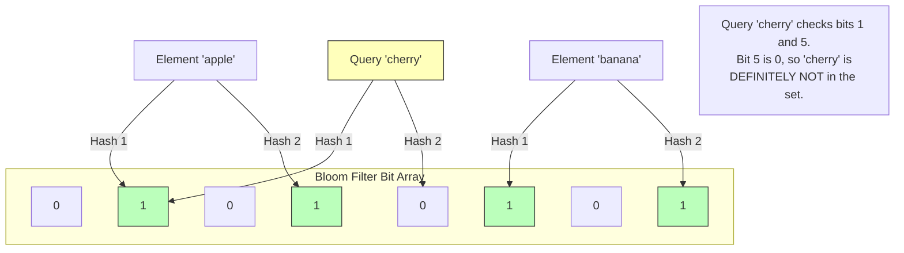

# Bloom Filters

## Concept

- A **Bloom Filter** is a space-efficient, probabilistic data structure used to test whether an element is a member of a set.
- It is designed to act as a fast, in-memory filter to shield databases or disks from useless query operations.
- The responses from a Bloom filter are:
  - **"Definitely not in the set"** (Guaranteed: 100% accuracy, zero false negatives).
  - **"Probably in the set"** (Likely: some probability of a false positive).
- Under the hood, a Bloom filter consists of:
  - A **Bit Array** of size $m$ bits, all initially set to $0$.
  - A set of $k$ independent, uniform **Hash Functions** ($h_1, h_2, \dots, h_k$) that map any input to one of the $m$ bit positions.

### Operations

1. **Insert (Add)**:
   - Run the input element through all $k$ hash functions to get $k$ array indices.
   - Set the bits at those indices to $1$.
2. **Lookup (Query)**:
   - Run the query element through the $k$ hash functions.
   - If **any** of the bits at those indices are $0$, the element is **definitely not** in the set.
   - If **all** of the bits are $1$, the element **might** be in the set.
3. **Delete**:
   - **Standard Bloom filters do not support deletion**. Since multiple elements can map to the same bit positions, resetting a bit to $0$ would delete other elements.
   - *Alternative*: **Counting Bloom Filters** replace the bit array with counter buckets (incrementing on insert, decrementing on delete) but require $3$-$4$ times more memory.

## Problem It Solves

- **Useless Disk I/O**: Prevents databases from searching slow disk SSTables or indexes for keys that do not exist in the database.
- **Resource Exhaustion**: Blocks malicious or wasteful queries early at the application layer before they impact downstream relational databases.

## Trade-offs

- **Pros**:
  - **Extremely Space Efficient**: Can track 10 million items with a 1% false positive rate using just $11.4$ MB of memory.
  - **Constant Time ($O(k)$)**: Inserts and lookups are independent of the number of items stored, depending only on the hash count $k$.
  - **Zero False Negatives**: Perfect for safety guards; you will never miss a real record.
- **Cons**:
  - **False Positives**: As the bit array fills up, more bits become $1$, and the false positive rate increases. The filter must be sized appropriately upfront.
  - **No Resize Support**: You cannot scale a Bloom filter. If you need a larger array, you must rebuild the entire filter from the raw source database.

## Examples

- **Apache Cassandra / RocksDB**: Every SSTable (disk data file) has an associated in-memory Bloom filter. The database checks the filter first. If it returns false, it skips reading the SSTable, avoiding slow disk accesses.
- **Medium**: Uses Bloom filters to filter out articles a user has already read from their recommendation feed.
- **Google Chrome**: Previously distributed a Bloom filter containing a list of known malicious URLs to client browsers to check websites offline before querying Google servers.
- **Interview framing**:
  - When designing high-throughput read systems (like a user registration lookup or a database caching layer): *"To optimize read performance and block useless queries, I will implement an in-memory **Bloom Filter** (e.g., using RocksDB or Redis Bloom). When looking up a username, if the Bloom filter returns false, we immediately return 'Not Found' without executing a database query. This provides a 100% guarantee of zero false negatives while protecting our databases from cache-miss spikes."*
