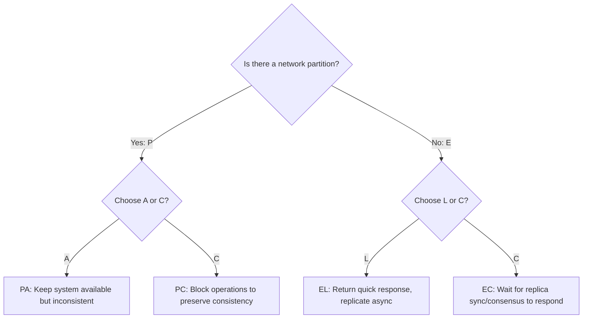

# PACELC Theorem

## Concept

- **PACELC Theorem** was formulated by Daniel Abadi in 2012 to address a core limitation of the CAP Theorem: CAP only describes system behavior when a network partition is actively occurring, leaving out how systems behave under normal conditions.
- **PACELC Definition**:
  - If there is a **P**artition, how does the system trade off **A**vailability vs. **C**onsistency?
  - **E**lse (under normal operations), how does the system trade off **L**atency vs. **C**onsistency?
- Every distributed database can be classified into one of four combinations based on these trade-offs:

| Classification | Under Partition (P) | Under Normal Operations (E) | Key Examples |
|---|---|---|---|
| **PC/EC** | Prefers **C**onsistency | Prefers **C**onsistency (quorums/consensus) | Google Spanner, CockroachDB |
| **PC/EL** | Prefers **C**onsistency | Prefers **L**atency (asynchronous replication) | MongoDB, Redis (configured) |
| **PA/EL** | Prefers **A**vailability | Prefers **L**atency (asynchronous replication) | Apache Cassandra, DynamoDB |
| **PA/EC** | Prefers **A**vailability | Prefers **C**onsistency (synchronous replication) | Configurable, but rarely used in practice |

## Problem It Solves

- **Normal-case evaluation**: Since network partitions are rare in well-managed datacenters (99.9% of the time), PACELC helps developers evaluate a system's latency characteristics during normal operations.
- **Granular database comparison**: Differentiates between systems like MongoDB and Cassandra, which are both traditionally lumped together as "NoSQL/AP" databases under CAP, but behave very differently under normal operations.

## Trade-offs

- **PC/EC (Consistency-First)**:
  - **Pros**: Zero data drift or stale reads, whether partitioned or not.
  - **Cons**: Write and read operations incur network hop latencies to reach consensus (Raft/Paxos/TrueTime) even under normal conditions.
- **PA/EL (Latency/Availability-First)**:
  - **Pros**: Sub-millisecond reads and writes. Continuous operation during network failures.
  - **Cons**: High likelihood of stale reads. Requires conflict resolution strategies (LWW, vector clocks) to resolve data drift when healing partitions.
- **PC/EL (Hybrid)**:
  - **Pros**: Fast local operations under normal conditions.
  - **Cons**: Under partition, parts of the database block writes to prevent data divergence.

## Examples

- **Google Spanner / CockroachDB (PC/EC)**: Ensure consistency under partitions (PC) and require consensus roundtrips to coordinate transactions under normal operations (EC).
- **MongoDB (PC/EL)**: If partitioned, writes to the isolated secondary nodes block (PC). Under normal conditions, writes are acknowledged by the primary first while secondaries replicate asynchronously to keep write latency low (EL).
- **Apache Cassandra / DynamoDB (PA/EL)**: Under partition, any node accepts writes and reads (PA). Normally, they use lightweight client quorums or async replication to achieve single-digit millisecond latency (EL).
- **Interview framing**:
  - In a system design interview, use PACELC to demonstrate Senior/Staff-level database selection: *"While CAP tells us what happens when our network breaks, **PACELC** dictates our daily performance. For a checkout service where double-charging is unacceptable, I will choose a **PC/EC** database like Spanner. For a user activity stream where write latency must be sub-millisecond, I will select a **PA/EL** system like Cassandra."*
