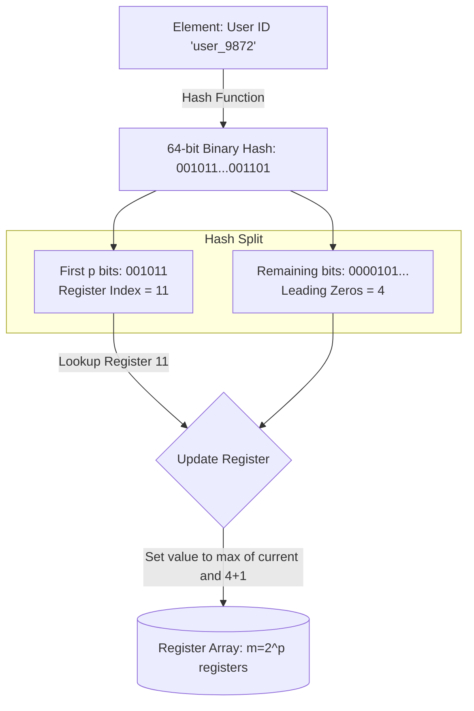

# HyperLogLog

## Concept

- **HyperLogLog (HLL)** is a probabilistic data structure used to estimate the cardinality (the number of unique elements) of a massive set.
- Traditional sets store all unique elements to calculate counts, which consumes memory that scales linearly ($O(N)$) with the cardinality. HyperLogLog computes this count with **constant memory** (typically 12KB) and a small, predictable error margin (~1.04%).

### The Mathematical Intuition

- If you hash elements into uniform random binary strings, the probability of seeing a sequence of $k$ leading zeros is:
  $$P(\text{leading zeros} = k) = \frac{1}{2^k}$$
- If you flip a coin and get 5 consecutive heads ($k=5$), you estimate you flipped the coin roughly $2^5 = 32$ times. If you see 20 consecutive heads, you estimate you flipped it millions of times.
- Thus, if the maximum number of leading zeros observed across all hashed elements is $R$, the estimated number of unique elements is roughly $2^R$.

### Stochastic Averaging (Reducing Variance)

- To prevent a single outlier hash (e.g., getting 30 leading zeros by chance early on) from corrupting the estimate, HLL uses **stochastic averaging**:

1. The bit representation of the hash value is split into two parts:
   - The first $p$ bits are used as a register index to select one of $m = 2^p$ registers (e.g., if $p=14$, there are $16,384$ registers).
   - The remaining bits are used to count the number of leading zeros ($L$).
2. The selected register's value is updated to:
   $$\text{register}[\text{index}] = \max(\text{register}[\text{index}], L + 1)$$
3. To calculate the final cardinality estimate, HLL takes the **harmonic mean** of the register values, scaled by a correction factor $\alpha_m$:
   $$\text{estimate} = \alpha_m m^2 \left( \sum_{j=1}^{m} 2^{-\text{register}[j]} \right)^{-1}$$
   *Note: Harmonic mean is used because it is highly resilient to outliers, filtering out random unrepresentative high-zero hashes.*

## Problem It Solves

- **DAU / MAU tracking**: Calculating unique monthly/daily active users in real-time on high-traffic websites (where storing a hash set per day for millions of users would consume gigabytes of expensive RAM).
- **Network Traffic Cardinality**: Routers counting unique destination IPs in streaming network traffic.

## Trade-offs

- **Pros**:
  - **Extreme Memory Savings**: Sized at exactly 12KB in Redis, HLL can count up to $2^{64}$ unique elements.
  - **Union/Merge Ability**: Multiple HLL structures can be merged (by taking the element-wise maximum of their registers) without losing accuracy. You can merge HLLs for Monday, Tuesday, and Wednesday to get the unique count for those three days.
  - **O(1) Time**: Updates and lookups are constant time.
- **Cons**:
  - **Estimated Result**: Standard error rate is typically $\approx 1.04/\sqrt{m}$.
  - **No membership testing**: You cannot ask: *"Has user A been counted?"* (Use a Bloom filter for membership).
  - **No data retrieval**: You cannot get the list of unique element IDs.

## Examples

- **Redis HyperLogLog**: Uses 16,384 registers (12KB).
  - `PFADD daily_active_users "user_1"` (Adds user to registry)
  - `PFCOUNT daily_active_users` (Returns estimated unique count)
  - `PFMERGE weekly_active_users mon tue wed thu fri sat sun` (Merges 7 HLL keys)
- **BigQuery / ClickHouse / Snowflake**: Provide `APPROX_COUNT_DISTINCT()` utilizing HLL to query petabytes of logs in seconds rather than minutes.
- **Google Analytics**: Tracks unique visitor counts across periods.
- **Interview framing**:
  - When asked to design unique user counters, IP counters, or real-time analytics engines: *"To compute unique user counts (DAU/MAU) at scale, I will use **HyperLogLog** instead of storing unique IDs in a database set. HLL hashes elements and updates an array of registers based on leading zero counts, allowing us to estimate counts up to $2^{64}$ using just 12KB of memory. To compute weekly active users, we will merge the daily HLL register arrays using a bitwise max operation, avoiding a full table scan of raw events."*
