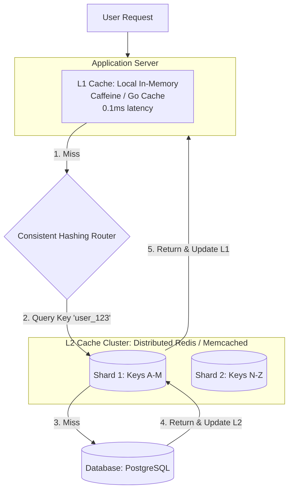

# Distributed Caching

## Concept

- **Distributed Caching** is a caching layer deployed across a cluster of multiple physical machines, acting as a single, logical, high-performance memory store.
- It extends single-process caching (which is constrained by the memory and network bandwidth of a single server) to support massive horizontal scaling.
- Core design patterns in distributed caching:

### 1. Partitioning (Sharding)

- Data is distributed across cache nodes using **Consistent Hashing** (topic 18).
- The client library or cache proxy hashes the key to locate the appropriate node, ensuring that adding or removing cache nodes does not invalidate the entire cache.

### 2. Replication

- To prevent data loss and maintain availability when a cache node crashes, each primary cache shard replicates its data to one or more replica nodes (active or passive replication).

### 3. Multi-Tier Caching (L1 / L2 Caching)

- **L1 (Local Cache)**: An in-process cache (e.g., Caffeine in Java, local memory in Node.js) stored directly on the application servers. Takes $0.1$ ms (no network).
- **L2 (Shared Cache)**: A centralized distributed cache cluster (e.g., Redis Cluster) shared by all application servers. Takes $1$-$2$ ms (LAN network).
- **Flow**: App checks L1. On miss, it checks L2. On miss, it queries the database and populates both L2 and L1.

### 4. Cache Synchronization and Invalidation

- Keeping caches in sync with the database is a primary challenge.
- **Pub/Sub Invalidation**: When an app server updates the database, it publishes an invalidation event to a message queue or Redis Pub/Sub. All other app instances listen to this channel and evict the corresponding key from their local L1 caches to prevent cache drift.

## Problem It Solves

- **Database Protection**: Prevents read-heavy traffic spikes from reaching and crashing downstream relational databases.
- **Single-Node Limits**: Overcomes physical RAM and network card (NIC) bottlenecks of single-instance Redis caches by spreading the memory and throughput load across many servers.

## Trade-offs

- **Pros**:
  - Horizontal scalability of both memory and read throughput.
  - High availability; failover replicas assume primary roles automatically.
  - Lowers global application latency.
- **Cons**:
  - **Cache Consistency Anomalies**: Invalidation lag can cause different application servers (reading different L1/L2 nodes) to serve different data versions to users.
  - **Deployment Complexity**: Managing cluster sharding, replication, failover sentinel daemons, and invalidation pipelines is complex.
  - **Network Hops**: Querying a remote L2 cache adds network latency compared to local memory caches.

## Examples

- **Redis Cluster**: Automatically shards data across 16,384 slots. Master nodes handle writes, while replica nodes mirror data for failover.
- **Memcached**: Uses client-side consistent hashing. Nodes do not communicate with each other, keeping the database extremely simple and fast.
- **Caffeine (L1) + Redis (L2)**: Enterprise Java frameworks (Spring Cache) combine local memory caches (L1) with centralized Redis (L2) to minimize network overhead for extremely hot keys.
- **Interview framing**:
  - When designing high-scale read-heavy applications (like feed APIs or session managers): *"To handle read throughput beyond a single node's limits, I will implement a **Two-Tier Distributed Caching system**. We will use an in-process **L1 cache** (like Caffeine) for the hottest metadata, backed by a sharded **L2 Redis Cluster** partitioned using consistent hashing. To prevent data divergence in our L1 caches, I will broadcast eviction messages via **Redis Pub/Sub** whenever writes occur in our primary database."*
