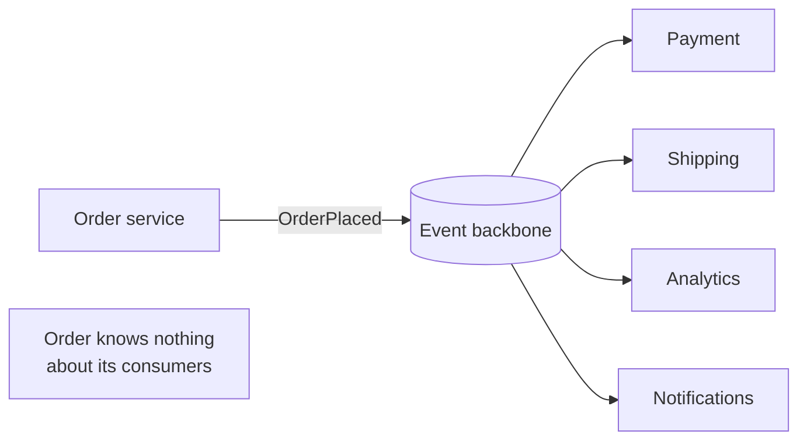

# Event-Driven Architecture

## Concept

- **Event-Driven Architecture (EDA)** is a style where services communicate by **producing and reacting to events** — immutable facts about something that happened (`OrderPlaced`, `PaymentReceived`) — rather than by calling each other directly (request/response).
- Producers emit events to an **event backbone** (a broker or streaming log, Phase 3 topic 21) without knowing who consumes them; consumers subscribe to the events they care about. This **inverts dependencies**: the producer doesn't depend on consumers at all.
- It's the umbrella under which CQRS (topic 9), event sourcing (topic 10), sagas (topic 11), and stream processing (topic 24) all live — they're specific patterns built on the event-driven foundation.
- Two flavors of "event": **event notification** (thin: "X happened, go look it up") and **event-carried state transfer** (fat: the event contains the data consumers need, avoiding callbacks).

## Problem It Solves

- **Loose coupling & extensibility** — adding a new reactor (a fraud-check or loyalty service that also listens to `OrderPlaced`) requires **zero changes** to the producer or existing consumers. The system grows by adding subscribers.
- **Resilience & temporal decoupling** — producer and consumer needn't be up at the same time; events buffer in the backbone, so a downstream outage doesn't fail the producer.
- **Scalability** — asynchronous, buffered communication absorbs spikes and lets each consumer scale independently.
- **A single source of truth stream** — the event log feeds many independent views and systems (search, cache, analytics, ML features) consistently.

## Trade-offs

- **Decoupling vs. observability** — no central place shows the end-to-end flow; understanding "what happens when an order is placed?" means tracing events across many services. Requires strong distributed tracing and event catalogs.
- **Eventual consistency** — reactions happen asynchronously, so the system is briefly inconsistent; consumers and UIs must tolerate in-flight states.
- **Event schema governance** — events are a public contract consumed by many services; evolving them (versioning, compatibility) is a real, ongoing discipline (a schema registry helps).
- **Debugging & ordering** — failures are async and can be hard to trace; ordering is only guaranteed within a partition (topic 26), and duplicate delivery means consumers must be idempotent (Phase 3, topic 22).
- **Choreography sprawl** — pure event choreography can create hidden, hard-to-follow chains; orchestration (Phase 3, topic 38) is sometimes the better coordination style.

## Examples

- **E-commerce backbone**
  - `OrderPlaced` is consumed independently by Payment, Inventory, Shipping, Analytics, Email, and a recommendation feature-store updater — all decoupled, each replayable from the log.
- **Event-carried state transfer**
  - `OrderPlaced` includes the order details so consumers don't call back to the order service, reducing coupling and load (at the cost of larger events and some duplication).
- **Reliable production**
  - Producers use the **outbox pattern** (Phase 3, topic 36) so the event is emitted atomically with the state change — EDA's correctness depends on this.
- **Interview framing**
  - Propose EDA when you need loose coupling, many independent reactions to the same business fact, or spike absorption. Immediately pair it with: outbox for reliable publishing, idempotent consumers, a schema registry for contract evolution, and tracing for observability. That bundle shows you've operated event-driven systems, not just heard of them.
