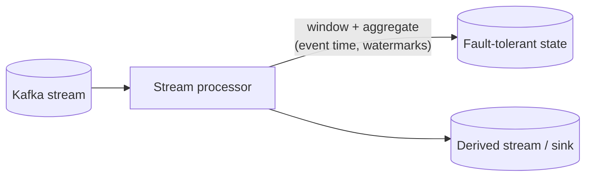

# Stream Processing

## Concept

- **Stream processing** computes over **unbounded, continuous** data in near-real-time — transforming, aggregating, joining, and enriching events as they arrive, rather than running a batch job over data at rest.
- It's the compute layer on top of an event streaming log (Kafka, topic 26): consume events, do work (filter, map, aggregate, join), and emit derived streams or update state/sinks — continuously, with low latency.
- Core concepts that make streaming hard and distinctive:
  - **Windowing** — since the stream never ends, aggregations are computed over **windows** of time (tumbling, sliding, session windows): "count clicks per 1-minute window."
  - **Event time vs. processing time** — events arrive late and out of order; computing by *event* time (when it happened) needs **watermarks** to decide when a window is "complete enough" to emit.
  - **Stateful processing** — joins and aggregations keep state (in a fault-tolerant state store) that must survive failures via checkpointing.

## Problem It Solves

- **Real-time insight and reaction** — fraud detection, live dashboards, trending/heavy-hitters (with sketches, topics 20–21), real-time recommendations, alerting — within seconds of events occurring, not hours later in a batch.
- **Continuous ETL** — enrich and reshape events on the fly into materialized views, search indexes, or feature stores (Phase 7).
- Handles the reality that data is **late, out-of-order, and never-ending**, which batch tooling isn't built for.

## Trade-offs

- **Latency vs. completeness (watermarks)** — emit a window early and you risk missing late events; wait longer for completeness and you add latency. Watermarks + allowed-lateness tune this; some frameworks emit early results and *update* them later.
- **Exactly-once is costly** — exactly-once stream semantics (Kafka transactions, Flink checkpoints) add overhead and only cover the streaming boundary, not arbitrary external side effects (topic on delivery semantics).
- **Stateful = fault-tolerance complexity** — large keyed state needs checkpointing/snapshotting and careful recovery; state can grow unbounded without TTLs.
- **Operational heaviness** — Flink/streaming clusters are complex to run, tune (parallelism, backpressure), and reason about compared to a batch job.
- **Batch vs. stream** — not everything needs real time; batch is simpler and cheaper when hourly/daily latency is fine (the basis of the Lambda/Kappa architecture debate).

## Examples

- **Frameworks**
  - Apache Flink (rich event-time, stateful, exactly-once), Kafka Streams (library, no separate cluster), Spark Structured Streaming (micro-batch), ksqlDB (SQL over Kafka).
- **Windowed aggregation**
  - "Clicks per ad per 1-minute tumbling window" → feeds the ad-click-aggregator case study; late clicks are handled via watermarks + allowed lateness.
- **Streaming join**
  - Join an `orders` stream with a `users` stream/table to enrich each order with user attributes in real time.
- **Sessionization**
  - Group a user's events into sessions with a 30-minute inactivity gap (session windows) for analytics.
- **Interview framing**
  - When a design needs real-time aggregation/enrichment/detection over a continuous feed, propose stream processing (Flink/Kafka Streams) and immediately raise **event-time vs processing-time, windowing, watermarks, and stateful fault tolerance**. Knowing that out-of-order/late data is the core challenge is what distinguishes a real streaming answer.
