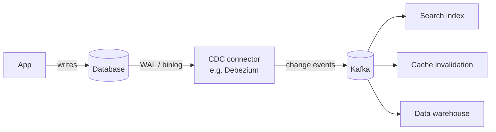

# Change Data Capture (CDC)

## Concept

- **Change Data Capture (CDC)** turns the changes happening in a database into a **stream of change events** that other systems can consume - capturing every insert/update/delete as it's committed.
- The robust implementation is **log-based CDC**: instead of polling tables or adding triggers, a connector **tails the database's transaction log** (the WAL/binlog - the same log the DB already writes for durability and replication, Phase 3 topic 9). Every committed change becomes an event in order, with low overhead and no impact on the application's writes.
- CDC makes a database an **event source** without changing the application: the source of truth stays in the DB, but its mutations flow out as a real-time stream.

## Problem It Solves

- **Keeps derived systems in sync with the source DB** in near-real-time: search indexes (Phase 3, topic 23), caches (invalidate on change), read models (CQRS, topic 9), data warehouses/lakes, and ML feature stores - all fed automatically from committed changes.
- **Solves the dual-write problem the right way**: instead of the app writing to the DB *and* publishing an event (which can diverge), CDC derives events directly from the committed log, guaranteeing they match what was persisted. It's the log-tailing implementation of the **outbox relay** (Phase 3, topic 36).
- Enables **zero-downtime migrations and replication** by streaming changes from old to new stores.
- Decouples analytics/derived workloads from the operational DB (no heavy read queries against production).

## Trade-offs

- **Log-based vs. simpler methods**: log tailing is efficient and complete but requires access to the DB's replication log and a connector per DB type; **query-based** CDC (polling a `updated_at` column) is simpler but misses deletes, adds load, and can miss intermediate states.
- **Eventual consistency**: consumers lag the source by the CDC pipeline delay; derived stores are never perfectly in-sync with the DB.
- **Schema evolution**: DB schema changes ripple into the change-event schema and must be handled downstream (a schema registry helps).
- **Ordering & idempotency**: change events must preserve per-row order (partition by primary key, topic 26) and be applied idempotently by consumers (replays/duplicates happen).
- **Operational dependency**: the CDC pipeline (e.g., Debezium + Kafka Connect) is critical infrastructure to run and monitor; initial **snapshots** of large tables can be heavy.

## Examples

- **Debezium**
  - The standard open-source CDC: connectors tail Postgres WAL, MySQL binlog, MongoDB oplog, etc., and publish change events to Kafka - powering search sync, cache invalidation, and data-lake ingestion.
- **Outbox via CDC**
  - The outbox table (Phase 3, topic 36) is tailed by CDC instead of a polling relay, giving low-latency, exactly-derived event publishing.
- **Cache invalidation**
  - A product row update emits a CDC event that invalidates `product:42` across the distributed cache - no manual invalidation call in app code.
- **DB → warehouse**
  - CDC continuously streams operational changes into Snowflake/BigQuery for analytics, replacing nightly bulk exports.
- **Interview framing**
  - Whenever a design must keep a search index, cache, read model, or warehouse in sync with a primary database, propose log-based CDC (Debezium → Kafka). Frame it as the correct solution to dual-writes and the engine behind outbox publishing - linking CDC, outbox, event sourcing, and EDA shows systems-level maturity.
