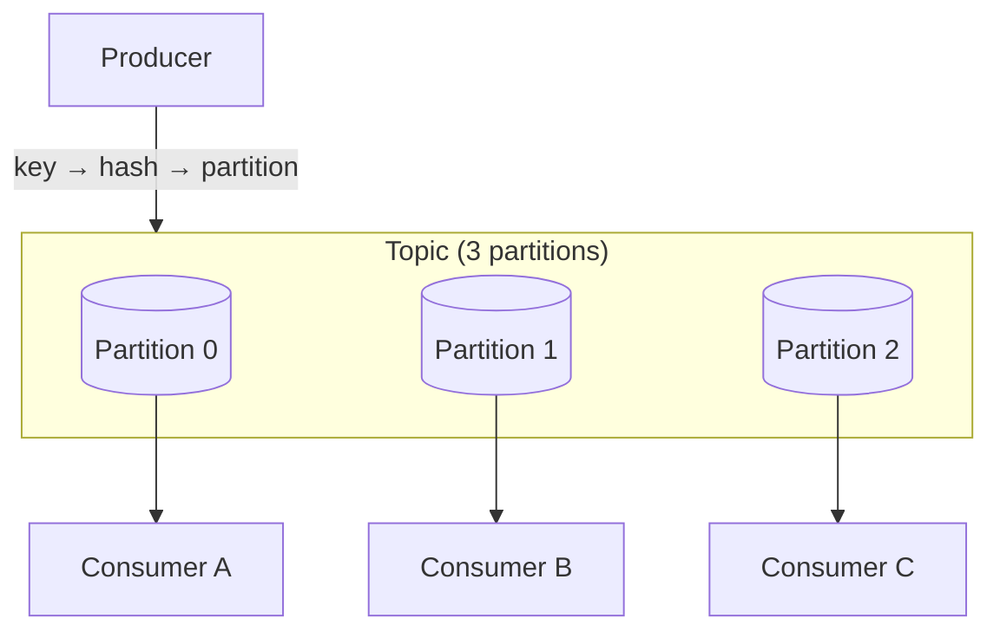

# Kafka Internals

## Concept

- **Apache Kafka** is a distributed, append-only **commit log** built for high-throughput event streaming. Understanding its internals explains how it achieves both durability and massive throughput.
- Key structures:
  - **Topic**: a named stream of events, split into **partitions**. Partitions are the unit of parallelism and ordering.
  - **Partition**: an ordered, immutable, append-only log of messages, each with a monotonically increasing **offset**. Order is guaranteed **only within a partition**, not across them.
  - **Broker**: a server hosting partitions. A cluster spreads partitions across brokers.
  - **Producer**: appends messages; chooses a partition by key (`hash(key) % partitions`) so all messages for a key land in the same partition (preserving per-key order).
  - **Consumer group**: a set of consumers that share a topic's partitions; **each partition is consumed by exactly one consumer in the group**, so partition count caps parallelism. Consumers track their own **offset**.
  - **Replication**: each partition has a leader and follower replicas; the **ISR (in-sync replicas)** set must acknowledge writes per the `acks` setting for durability.
- Throughput comes from **sequential disk I/O** (append-only), **zero-copy** transfer, batching, and the OS page cache - not from keeping data in RAM.

## Problem It Solves

- **Very high throughput with durability**: millions of messages/sec persisted to disk, because appends are sequential and reads use zero-copy + page cache.
- **Ordered, replayable event log**: consumers read at their own offset and can **replay** history (rewind offsets) to rebuild state or backfill new consumers (the streaming-log model, Phase 3 topic 21).
- **Horizontal scale via partitions**: add partitions/brokers to scale throughput; consumer groups parallelize processing.
- **Multi-consumer fan-out**: many independent consumer groups read the same topic without interfering, each tracking its own offset.

## Trade-offs

- **Ordering only within a partition**: global ordering across a topic isn't guaranteed; if you need ordering for a key, you must partition by that key (and accept that one hot key concentrates on one partition - hot-partition problem, Phase 3 topic 32).
- **Partition count is a commitment**: it caps consumer-group parallelism and is awkward to change later (changing it breaks key→partition mapping). Size it for future throughput.
- **Durability vs. latency (`acks`)**: `acks=all` (wait for all ISR) is durable but slower; `acks=1` (leader only) is faster but can lose data on leader failure; `acks=0` is fire-and-forget.
- **Rebalancing pauses**: when consumers join/leave, partitions are reassigned, briefly pausing consumption (stop-the-world rebalances; mitigated by cooperative rebalancing).
- **Not a database**: Kafka is a log, not a queryable store; retention/compaction policies govern how long data lives (compaction keeps the latest value per key).

## Examples

- **Per-key ordering**
  - Keying events by `user_id` guarantees all of one user's events stay ordered in one partition while different users parallelize across partitions/consumers.
- **Consumer group scaling**
  - A topic with 12 partitions supports up to 12 parallel consumers in a group; a 13th sits idle. Scale throughput by adding partitions *and* consumers together.
- **Replay**
  - Reset a consumer group's offsets to reprocess a week of events after fixing a bug - the log retained them.
- **Log compaction**
  - A `user-profiles` topic keyed by user keeps only the latest event per user, acting as a changelog/snapshot store.
- **Interview framing**
  - When you choose Kafka, demonstrate the internals: "partition by key for ordering and parallelism, size partitions for target throughput, `acks=all` with ISR for durability, consumers track offsets and can replay." Connecting partition count to consumer parallelism and hot keys is exactly the depth interviewers probe.
