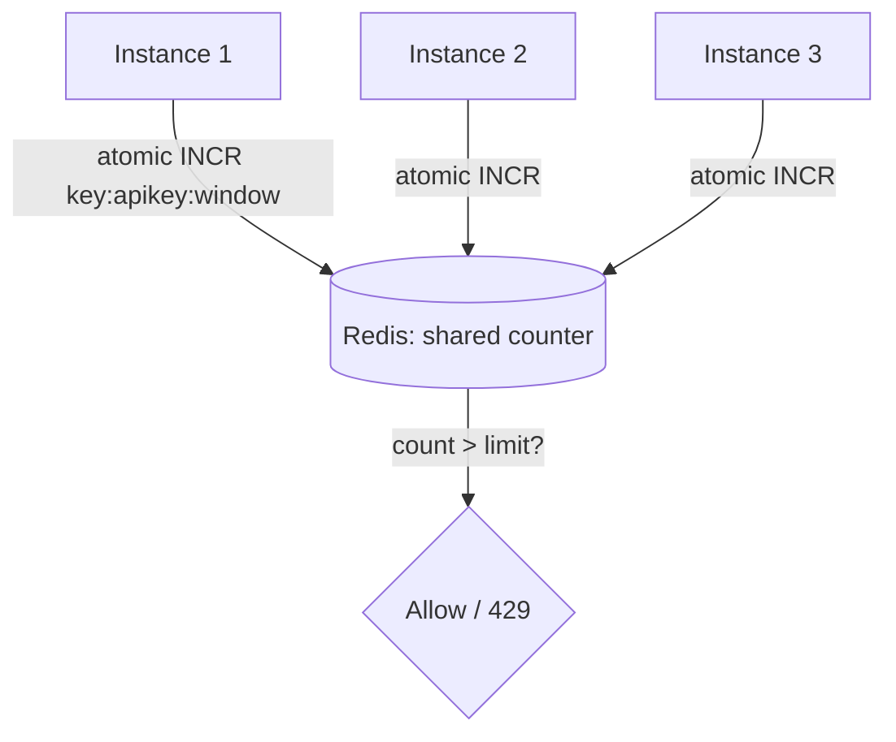

# Distributed Rate Limiting

## Concept

- This extends single-node rate limiting (Phase 2, topic 17) to a **fleet of servers** that must enforce **one global limit** (e.g., "1000 requests/min per API key" across *all* instances), not a separate limit per instance.
- The challenge: if each of 50 instances independently allows 1000/min, the real limit becomes 50,000/min. Enforcing a *shared* limit requires **shared, consistent counter state** that all instances read and update - typically in a fast central store (Redis).
- The same algorithms apply (token bucket, sliding window log/counter, fixed window), but now the counter lives in a shared store and updates must be **atomic** across instances:
  - **Centralized counter (Redis)**: atomic `INCR`/Lua script per key per window; simple and accurate but adds a network hop per request and makes Redis a hot dependency.
  - **Local + sync (approximate)**: each instance limits locally against its share of the budget and periodically reconciles, trading accuracy for lower latency.

## Problem It Solves

- Enforces a **true global limit** regardless of how requests are distributed across instances - protecting backends, ensuring fair use, and metering API quotas correctly.
- Prevents the "N instances × per-instance limit" inflation that makes naive per-node limiting useless behind a load balancer.
- Centralizes quota state so limits are consistent even as the fleet autoscales.

## Trade-offs

- **Accuracy vs. latency/throughput**: a centralized Redis counter is accurate but adds a round-trip per request and concentrates load on Redis (a potential bottleneck/SPOF); local-with-sync is fast but approximate (can briefly over- or under-limit).
- **Atomicity required**: naive `GET`/`INCR`/`SET` sequences race across instances; use atomic operations or a Lua script so concurrent instances don't both pass the check (relates to distributed correctness, topic 13).
- **Algorithm trade-offs carry over**: fixed windows allow boundary bursts (2× at the edge of two windows); sliding-window log is accurate but memory-heavy; sliding-window counter is the common balance (Phase 2, topic 17).
- **Hot keys**: a single heavily-used API key concentrates counter writes on one Redis slot (hot-partition problem, Phase 3 topic 32); mitigate by sharding the key's counter and summing.
- **Failure mode**: if the rate-limit store is down, decide fail-open (allow, risking overload) vs fail-closed (block, risking false denials).

## Examples

- **Redis sliding-window counter**
  - A Lua script atomically increments a per-key, per-window counter (or trims a sorted set of timestamps) and returns allow/deny - one round trip, globally consistent across the fleet.
- **API gateway quotas**
  - The gateway (Phase 3, topic 7) enforces per-key quotas via a shared store so limits hold no matter which backend instance serves the request.
- **Token bucket in Redis**
  - Store tokens + last-refill timestamp per key; a script refills based on elapsed time and decrements atomically - supports bursts up to the bucket size with a steady refill rate.
- **Local + global hybrid**
  - Each instance gets a sub-budget and limits locally for speed, syncing counts to Redis periodically - used when per-request Redis latency is unacceptable.
- **Interview framing**
  - When rate limiting behind multiple instances, state explicitly that the limit must be **global**, kept in a shared store with **atomic** updates, and pick the algorithm. Raising hot-key sharding and the fail-open/fail-closed decision shows production depth beyond the single-node version.
