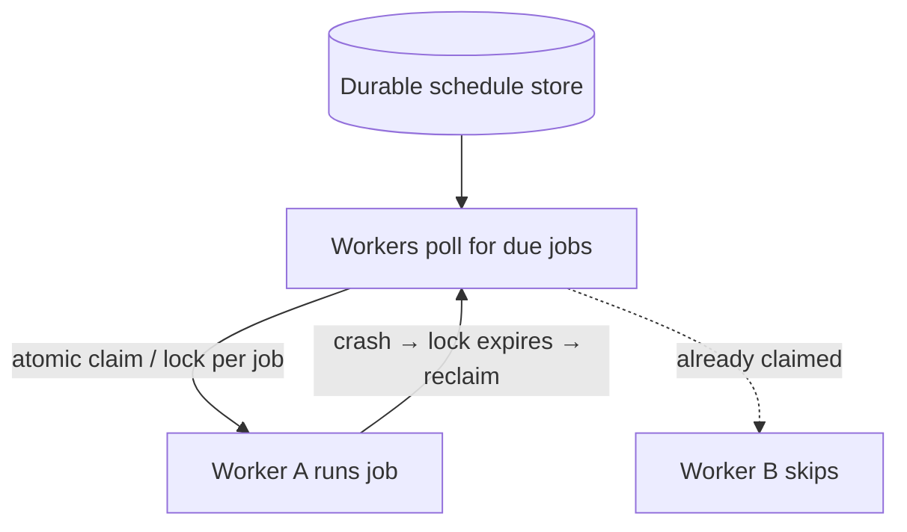

# Distributed Scheduling

## Concept

- **Distributed scheduling** runs time-based or recurring jobs (cron-like tasks, delayed jobs, timers) reliably across a **cluster** - guaranteeing each scheduled job fires **once** (not zero times, not N times) even though many instances are running.
- The naive approach - a cron entry on every server - fires the job N times (once per instance). The naive fix - cron on one server - has no failover (if that box dies, the job never runs). Distributed scheduling solves both: **exactly one** instance runs each occurrence, with **failover** if that instance dies.
- Building blocks:
  - **Leader election / locking**: elect a single scheduler (topic 17) or have instances grab a distributed lock per job occurrence (Phase 3, topic 16) so only one executes it.
  - **Durable job store**: persist schedules and due times so a restart doesn't lose them; a worker polls for due jobs and claims them atomically.
  - **Time-bucketing / timer wheels**: for huge numbers of timers (e.g., "remind me in 24h" × millions), store jobs in time-bucketed partitions and scan the current bucket.

## Problem It Solves

- Guarantees **once-per-occurrence execution** of scheduled work across a fleet (billing runs, report generation, cleanup jobs, sending scheduled notifications) without duplicates or gaps.
- Provides **failover**: if the instance running a job dies, another picks it up (via lease expiry), so a single machine failure doesn't skip the job.
- Scales to **massive numbers of timers/delayed jobs** (reminders, retries, TTL actions) that a single cron can't manage.

## Trade-offs

- **Exactly-once is hard**: like all distributed delivery, true exactly-once execution is unattainable; you get at-least-once (a job may run twice if a worker is wrongly presumed dead) or at-most-once, so jobs should be **idempotent** (Phase 3, topic 22).
- **Lock/lease tuning**: too-short leases let a slow job get re-run by another worker (duplicate); too-long leases delay failover when a worker truly dies (gap).
- **Clock dependence**: scheduling relies on time; clock skew across nodes can fire jobs early/late (needs NTP; some systems use a logical authority).
- **Scale of timers**: millions of fine-grained timers need partitioned time buckets / timer wheels, not a single sorted queue, to avoid a scan bottleneck and hot partitions.
- **Thundering herd**: many jobs due at the same instant (e.g., midnight) can spike load; jitter/spread execution.

## Examples

- **Leader-based cron**
  - Instances elect a leader (etcd lease); only the leader triggers scheduled jobs, with automatic re-election on failure (Kubernetes CronJobs rely on the control plane similarly).
- **Claim-based job queue**
  - A `jobs` table with `run_at` and a status; workers `SELECT … FOR UPDATE SKIP LOCKED` to atomically claim due jobs, run them idempotently, and a lease lets another worker reclaim a job if the first crashes.
- **Massive delayed jobs**
  - "Send reminder in 24h" for millions of users: jobs are bucketed by due-minute; a sweeper scans the current bucket and enqueues those due - the design behind the distributed-job-scheduler case study.
- **Managed services**
  - Temporal (durable timers + workflows), Quartz (clustered), AWS EventBridge Scheduler, and Kubernetes CronJobs provide distributed scheduling primitives.
- **Interview framing**
  - For "run this job reliably across the cluster" or "schedule millions of delayed actions," describe single-execution via leader election or atomic claim/lock, failover via lease expiry, idempotent jobs, and time-bucketing for scale. This is exactly the distributed-job-scheduler case study's core.
