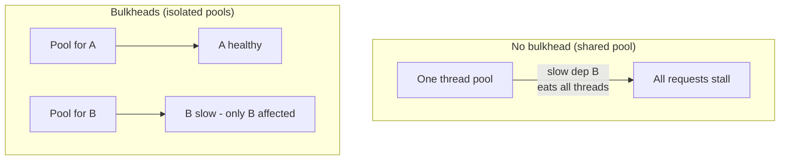

# Bulkheads

## Concept

- The **bulkhead pattern** isolates resources so that a failure or overload in one part of a system **cannot drain the resources** the rest of the system needs - named after the watertight compartments in a ship's hull that keep a single breach from sinking the whole vessel.
- The core mechanism: **partition shared resources** (thread pools, connection pools, queues, compute) into separate compartments per dependency, tenant, or workload, each with its own bounded capacity. When one compartment is exhausted, the others are unaffected.
- It directly counters the failure mode where one slow dependency consumes *all* of a caller's threads/connections, starving every other request - turning a localized problem into a total outage.

## Problem It Solves

- Prevents **resource-exhaustion cascades**: without bulkheads, a single dependency timing out ties up the shared thread pool until nothing else can run, so one failing downstream takes down the whole service.
- **Contains the blast radius** of a failure or overload to one compartment, preserving capacity for unrelated traffic.
- Combined with circuit breakers (Phase 3, topic 8) and timeouts, it's a core resilience pattern: timeouts bound waiting, breakers stop calling a dead dependency, bulkheads ensure one dependency can't monopolize resources.

## Trade-offs

- **Isolation vs. utilization**: partitioning resources into fixed compartments means each is smaller; a compartment can be saturated while another sits idle, lowering overall utilization compared to one shared pool. You trade some efficiency for safety.
- **Sizing complexity**: you must size each compartment for its workload; too small throttles a healthy dependency, too large weakens the isolation.
- **More moving parts**: multiple pools/queues to configure and monitor instead of one.
- **Granularity choice**: isolate per *dependency* (so a slow third-party API can't starve DB calls), per *tenant* (noisy-neighbor protection, Phase 3 topic 28), or per *workload class* (interactive vs batch) - each has different overhead.

## Examples

- **Per-dependency thread pools**
  - A service gives the payment provider its own pool of 10 threads and the recommendations API another pool of 5. If recommendations hangs, it exhausts only its 5 threads; payment and core requests keep flowing. (Hystrix/Resilience4j bulkhead isolation.)
- **Connection-pool partitioning**
  - Separate DB connection pools for critical (checkout) vs non-critical (reporting) queries so a flood of slow reports can't starve checkout of connections (Phase 3, topic 15).
- **Tenant isolation**
  - In multi-tenant SaaS (Phase 3, topic 28), per-tenant resource pools or dedicated cells stop one tenant's spike from degrading others.
- **Semaphore bulkhead**
  - A lightweight cap (semaphore of N concurrent calls) per dependency limits in-flight calls without dedicated threads.
- **Interview framing**
  - When one service depends on several others, mention bulkheads alongside timeouts and circuit breakers: "I'd isolate each downstream behind its own bounded pool so a slow dependency can't exhaust threads and cascade." Framing it as blast-radius containment ties into cell-based architecture (topic 32).
