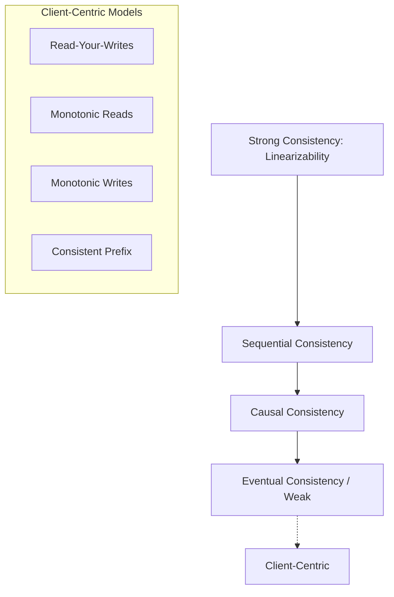
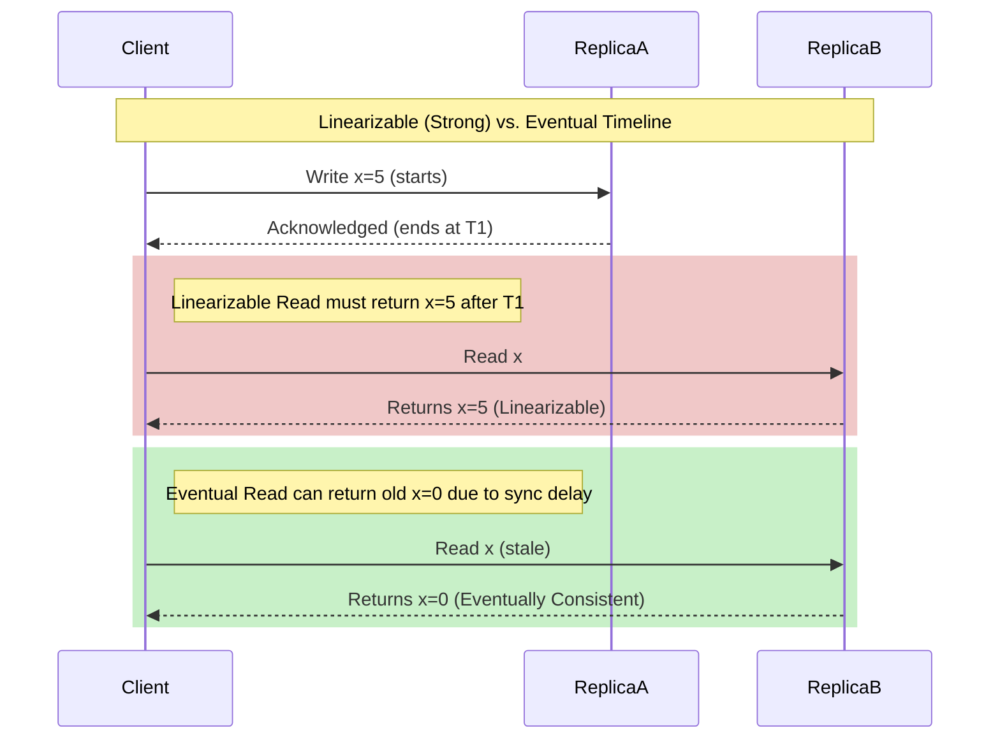

# Consistency Models

## Concept

- **Consistency Models** define the rules for the visibility and ordering of updates across distributed replicas. They establish a formal contract between the distributed data store and the application regarding what values a read operation is allowed to return.
- Consistency models exist on a spectrum from **Strong (highly ordered, high latency)** to **Weak (relaxed ordering, low latency)**:

### Data-Centric Consistency Models

1. **Linearizability (Strong Consistency)**:
   - Operations appear to execute atomically at a specific point in time between their invocation and their completion.
   - Requires a global, real-time physical order. Once a write completes, all subsequent reads (in wall-clock time) anywhere in the system must return that write or a newer one.
2. **Sequential Consistency**:
   - Relaxed linearizability. Does not care about absolute physical time, but guarantees that all nodes see all operations in the same sequence, and the sequence respects the program order of each individual process.
3. **Causal Consistency**:
   - Weakened sequential consistency. Operations that are causally related (e.g., a reply to a message) must be seen in the same order by all nodes. Operations that are concurrent (no causal relationship) can be seen in different orders on different nodes.
4. **Eventual Consistency**:
   - The weakest model. Replicas will eventually converge to the same value if no new writes are made. Reads can return stale data indefinitely until convergence.

### Client-Centric Consistency Models

- **Read-Your-Writes**: A client will always read their own updates (no "disappearing write" after page refresh).
- **Monotonic Reads**: If a client reads value $v_1$, they will never subsequently read an older value $v_0$ (time cannot flow backward for a client).
- **Monotonic Writes**: A client's writes are serialized and executed in the order they were submitted.
- **Consistent Prefix**: A reader sees updates in the order they were written (e.g., replies always appear after the parent comment).

## Problem It Solves

- **Prevents race conditions**: Avoids logical errors in applications where multi-node updates cause inconsistent user states (e.g., seeing a bank transfer completed on one device but missing on another).
- **Performance tuning**: Allows system designers to select the weakest model acceptable for their use case to maximize performance and throughput.

## Trade-offs

- **Linearizability**:
  - **Pros**: Easy to program against; acts like a single database.
  - **Cons**: High latency (consensus overhead). Vulnerable to network partitions (must block operations, CAP).
- **Causal Consistency**:
  - **Pros**: High availability under partitions. Lower latency than linearizability.
  - **Cons**: Overhead of tracking causal dependencies (vector clocks/dependency graphs).
- **Eventual Consistency**:
  - **Pros**: Maximum write availability and performance. Extremely low latency.
  - **Cons**: Difficult to program. Requires developers to handle replica drift and merge conflicts.

## Examples

- **Linearizable**: **etcd / ZooKeeper** (metadata stores), **Google Spanner** (uses GPS clocks and Atomic clocks to achieve external consistency / linearizability).
- **Causal**: **Git** (commits form a directed acyclic graph representing causal history), comments/chat threads (replies linked causally).
- **Eventual**: **DNS** (updates propagate slowly worldwide), **Amazon DynamoDB / Cassandra** (configurable reads/writes).
- **Interview framing**:
  - When asked to design a collaborative application (like a shared document or social feed), explain why you do *not* need linearizability: *"Linearizability is too slow and unnecessary for a social feed. Instead, I will design for **Causal Consistency** to ensure that comments and their replies are ordered correctly, and use **Read-Your-Writes** so a user immediately sees their own post, while allowing other users to see the post eventually."*
