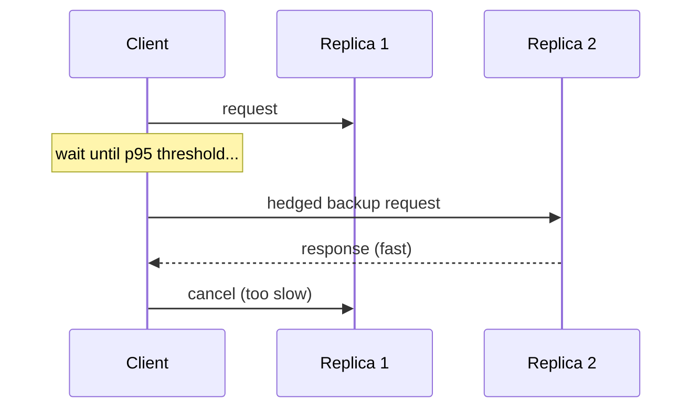

# Request Hedging

## Concept

- **Request hedging** (a.k.a. backup requests or speculative retries) is a **tail-latency** reduction technique: send a request to one replica, and if it doesn't respond within a short threshold (e.g., the p95 latency), send a **second copy** to another replica and use **whichever responds first**, cancelling the loser.
- It targets the reality that in a large fleet, *some* requests are slow for transient reasons (a GC pause, a busy node, a slow disk) even when the system is healthy. Hedging routes around those stragglers instead of waiting for them.
- The key is to hedge **only the slow tail**, not every request: fire the backup only after the original exceeds a latency threshold, so you add minimal extra load (just a few percent) while dramatically cutting p99/p99.9 latency.

## Problem It Solves

- **Cuts tail latency (p99/p99.9)**: the slowest few percent of requests dominate user-perceived latency in fan-out systems (a page that waits on 100 backend calls is as slow as the slowest one). Hedging makes the tail far tighter without making the median path slower.
- Tolerates transient per-node slowness (a momentarily overloaded or GC-paused replica) automatically, without needing to detect or eject the node.
- Especially valuable in **high-fan-out** requests where one straggler stalls the whole response.

## Trade-offs

- **Extra load vs. latency gain**: every hedge is duplicated work; hedging *all* requests would roughly double load. The discipline is to hedge only after a high-percentile threshold so extra load stays small (~5%) while capturing most of the tail benefit.
- **Idempotency required**: the same operation now runs on two replicas, so it **must be idempotent** (Phase 3, topic 22) or you risk double side effects. Hedging is safe for reads and idempotent operations, dangerous for non-idempotent writes.
- **Cancellation**: you should cancel the loser to avoid wasted work; without cancellation, both complete and amplify load.
- **Can worsen overload**: under systemic overload (not just a single straggler), hedging adds load and can make things *worse*; it should be disabled or throttled when the whole system is saturated (interacts with retry storms, topic 31).
- **Coordination**: needs replica selection that avoids sending the hedge to the same (possibly overloaded) node.

## Examples

- **Google's "tail at scale"**
  - The canonical source: backup requests after a brief delay reduced p99 latency for fan-out services dramatically while adding only a few percent more requests.
- **Distributed storage/DB reads**
  - Read from one replica; if it's slow past the threshold, read from another and take the first answer - common in Cassandra (speculative retry), DynamoDB clients, and distributed file systems.
- **Search fan-out**
  - A query hitting many shards hedges the slow shards so one straggler doesn't determine total latency.
- **Interview framing**
  - When asked to reduce p99/tail latency (especially in high-fan-out reads), propose hedged/backup requests fired only past a high-percentile threshold, on idempotent operations, with cancellation - and note it must back off under systemic overload. Citing the read-only/idempotent constraint is the detail that shows you understand its risk.
