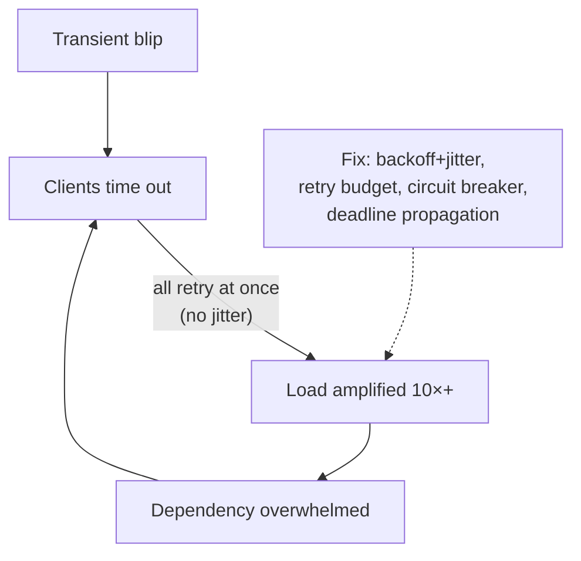

# Retry Storms & Failure Domains

## Concept

- **Retry storms** (a.k.a. retry amplification or metastable failure) occur when a transient failure triggers *every* client to retry simultaneously, and those retries **multiply the load** on an already-struggling system - turning a brief blip into a sustained, self-sustaining outage that persists even after the original trigger is gone.
- The mechanism: a dependency slows → callers time out and retry → retries add load → the dependency slows further → more timeouts and retries → collapse. Each layer that retries multiplies load (3 retries × 3 layers = up to 27× the original requests).
- A **failure domain** (blast radius) is the set of components that fail together when one thing fails. Good design **bounds failure domains** so a failure is contained rather than global. Retry storms are dangerous precisely because naive retries *expand* the failure domain to the whole system.
- The cures: **exponential backoff + jitter** (spread retries out and randomize them), **retry budgets** (cap retries as a fraction of total requests, e.g., 10%), **circuit breakers** (stop retrying a dead dependency), and **deadline propagation** (don't retry work whose deadline already passed).

## Problem It Solves

- Prevents the common, catastrophic pattern where a recoverable hiccup becomes a **metastable outage** that doesn't self-heal because retry load keeps the system pinned down.
- Bounds the **blast radius** of failures so one slow dependency or one bad shard doesn't cascade into a full outage.
- Makes retry behavior *safe* - retries should improve reliability, but naive retries are one of the top causes of large-scale outages.

## Trade-offs

- **Retries help vs. retries harm**: retries recover transient failures but amplify systemic ones; the goal is to retry *transient* failures gently while *not* retrying when the system is broadly overloaded.
- **Backoff + jitter is mandatory**: fixed-interval retries synchronize clients into thundering herds; **full jitter** (random delay in `[0, cap]`) de-correlates them. This is the single most important mitigation (ties to DLQ/retry strategies, Phase 3 topic 35).
- **Retry budgets vs. completeness**: capping retries (e.g., adaptive retry / token bucket of retries) protects the system but means some requests fail fast instead of eventually succeeding.
- **Layered retries compound**: retries at multiple layers multiply; prefer retrying at **one** layer and propagating deadlines so inner layers don't retry work the outer layer has already given up on.
- **Detecting systemic vs transient**: hard; circuit breakers and load-based retry suppression help the system stop retrying when broadly unhealthy.

## Examples

- **Full jitter backoff**
  - Instead of retrying at 1s, 2s, 4s exactly (which synchronizes everyone), wait `random(0, min(cap, base·2^attempt))` so retries spread out - AWS's documented approach to avoiding retry storms.
- **Retry budget**
  - A client library allows retries only up to 10% of request volume; beyond that it fails fast, preventing amplification (gRPC/Envoy retry budgets, Finagle).
- **Deadline propagation**
  - A request carries a deadline; each hop checks remaining time and skips retries (or the whole call) if the deadline has passed - no wasted retry of doomed work.
- **Circuit breaker stops the storm**
  - When a dependency is failing, the breaker opens and callers stop retrying entirely, giving it room to recover (Phase 3, topic 8).
- **Interview framing**
  - Any time you add retries, immediately add the safeguards: "exponential backoff with full jitter, a retry budget, circuit breakers, and deadline propagation, retrying at a single layer." Explaining retry amplification and metastable failure - and bounding the failure domain - is exactly the resilience depth expected at Staff level.
