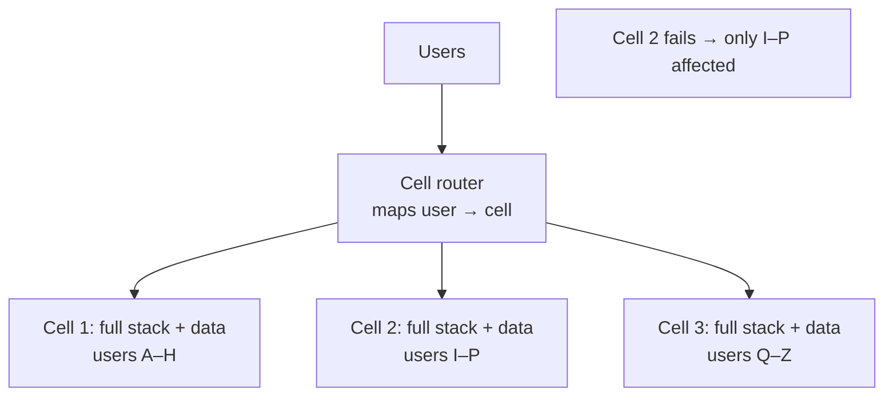

# Cell-Based Architecture

## Concept

- **Cell-based architecture** is a blast-radius-containment pattern: the system is partitioned into multiple independent, isolated **cells**, each a complete, self-contained instance of the stack (services + data) that serves a **subset of users/tenants**. A failure in one cell affects only that cell's users, never the whole system.
- A thin **cell router** maps each request to its owning cell (by user ID, tenant, or another partition key) and routes it there. Cells share little or nothing; they don't depend on each other for serving requests.
- It's the architectural generalization of bulkheads (topic 29) and failure domains (topic 31), applied at the **whole-system** level: instead of one giant deployment where a bad change or overload affects 100% of users, you have N cells where any single failure is capped at ~1/N of users.
- This is how the largest providers limit the impact of outages and bad deployments (AWS, Slack, and others describe cell-based designs).

## Problem It Solves

- **Caps blast radius** — a bug, bad deploy, data-corruption event, poison input, or overload is contained to one cell (~1/N of users) instead of taking down everyone. This bounds the worst-case impact of *any* failure.
- **Safer deployments** — roll out a change to one cell first (a natural canary), observe, then proceed cell by cell; a bad release harms only the first cell.
- **Scalability ceiling avoidance** — each cell has a known capacity; you scale by adding cells (a tested, repeatable unit) rather than scaling one ever-larger system into unknown territory.
- **Noisy-neighbor / poison-pill isolation** — one tenant's pathological load or a poison message is confined to its cell.

## Trade-offs

- **Isolation vs. complexity & cost** — running N full stacks is more operational overhead and often more resource cost (less statistical multiplexing) than one big deployment; you trade efficiency for containment.
- **The router is critical shared infrastructure** — it must be extremely simple, highly available, and itself not a single point of failure (kept thin precisely so it rarely fails or changes).
- **Cross-cell operations are hard** — anything spanning users in different cells (global search, cross-tenant features, analytics) needs a separate aggregation path, since cells are isolated.
- **Rebalancing/placement** — assigning and moving users between cells (and sizing cells) is real operational work; cells should be sized so losing one is tolerable.
- **Data partitioning** — each cell owns its slice of data (like sharding, Phase 3 topic 14), so the partition-key and hot-cell concerns apply.

## Examples

- **Per-cell full stack**
  - Each cell has its own load balancers, services, caches, and databases serving a fixed set of tenants; a corrupted cache or runaway query in cell 3 degrades only cell 3's users.
- **Cell-by-cell deploys**
  - A new version ships to cell 1; if error rates spike, the blast radius is one cell and the rollout stops — a structural safety net beyond canary (Phase 6 deployment strategies).
- **AWS / Slack-style cells**
  - Large services route customers to cells and explicitly engineer so that no single cell failure can become a regional/global outage.
- **Relation to multi-tenancy**
  - For enterprise SaaS, the largest tenants may get dedicated cells (silo-like isolation, Phase 3 topic 28) while smaller tenants share pooled cells.
- **Interview framing**
  - For very-high-availability systems where a global outage is unacceptable, propose cell-based architecture: partition users into isolated full-stack cells behind a thin router, deploy cell-by-cell, and accept the efficiency cost for bounded blast radius. Framing it as the system-level generalization of bulkheads and failure domains demonstrates Staff/Principal-level reliability thinking.
