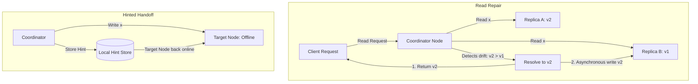

# Eventual Consistency

## Concept

- **Eventual Consistency** is a weak consistency model that guarantees that if no new updates are made to a given data item, all replicas will eventually converge to the same value and return the latest version.
- Replicas process writes independently and replicate changes asynchronously.
- Distributed databases that use eventual consistency rely on three main synchronization mechanisms to achieve convergence:

1. **Read Repair**:
   - When a client reads a key, the coordinator node queries multiple replicas.
   - If it detects that replica values are inconsistent (using version numbers or timestamps), it returns the newest value to the client and asynchronously writes the newest value back to the stale replicas.
2. **Hinted Handoff**:
   - If a replica is offline during a write, the coordinator stores the write locally as a "hint" (the metadata about the write).
   - Once the coordinator detects that the target replica is back online, it replays the saved hints to bring the node up to date.
3. **Active Anti-Entropy (Merkle Trees)**:
   - A background synchronization process that compares replicas to locate differences.
   - To avoid scanning the entire database over the network, replicas maintain a **Merkle Tree** (a binary tree of cryptographic hashes) of their data ranges. Nodes exchange only the root hash; if they match, no sync is needed. If they differ, nodes traverse down the tree to identify the exact leaf ranges that differ and sync only those.

## Problem It Solves

- **Continuous availability**: Keeps systems functional even during network splits or datacenter failures.
- **Low latency**: Prevents the application from waiting for global network roundtrips to confirm writes.
- **Handles massive write volumes**: Absorbs spikes because write operations don't block.

## Trade-offs

- **Pros**:
  - High availability and fault tolerance.
  - Sub-millisecond write performance.
  - High read throughput by reading from the closest node.
- **Cons**:
  - **Stale reads**: Users may see old profiles, deleted messages, or incorrect inventory levels.
  - **Conflict resolution complexity**: Converging diverged replicas is hard. Simple rules like *Last-Write-Wins* (LWW) lose updates due to wall-clock skew.
  - **Broken invariants**: Cannot easily guarantee strict unique fields (e.g., two users registering the same username at the same time on different partitions).

## Examples

- **Apache Cassandra / DynamoDB**: Masterless systems utilizing read-repair, hinted handoffs, and Merkle trees to reconcile replica drift.
- **Domain Name System (DNS)**: When you update a DNS record, it takes hours (TTL expiration) to propagate globally.
- **Collaborative software (Git / Apple Notes)**: Users work offline (replicas) and merge changes when connected.
- **Interview framing**:
  - When design requires high scale and writes cannot fail (e.g., adding items to a shopping cart or posting tweets), propose eventual consistency. Immediately show engineering depth by explaining how you will handle conflicts: *"For eventual consistency, I will use **Read Repair** for hot keys, **Hinted Handoff** to tolerate brief node restarts, and background **Active Anti-Entropy with Merkle Trees** for cold data reconciliation. To resolve conflicts safely, I will avoid LWW and instead use **CRDTs** (topic 14) or application-level merges."*
