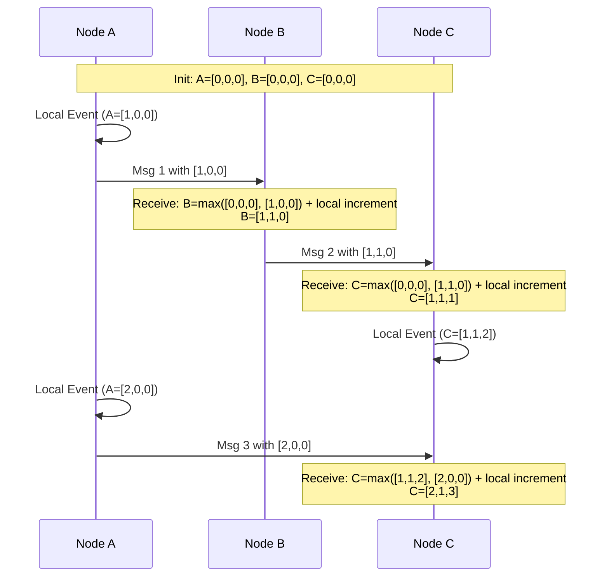

# Logical Clocks and Vector Clocks

## Concept

- **Physical clocks** (wall-clock time) cannot be trusted to order events in distributed systems. Due to thermal variations and hardware drift, clocks across different machines diverge. Network Time Protocol (NTP) synchronizes clocks but can introduce backward adjustments (clock jumps) and cannot guarantee sub-millisecond ordering accuracy.
- Distributed systems use **logical clocks** to order events based on causality (the "happens-before" relationship, denoted as $a \to b$) rather than physical time.

### Lamport Clocks

Each node maintains a single integer counter $L$, initialized to 0:
1. Before a node executes a local event, it increments its clock: $L = L + 1$.
2. When sending a message $m$, the node attaches its current clock value $L$.
3. Upon receiving message $m$ with timestamp $L_m$, the receiving node updates its clock: $L = \max(L, L_m) + 1$.

- **Limitation**: Lamport clocks provide a partial ordering. If event $a$ causally happened before $b$ ($a \to b$), then $L(a) < L(b)$. However, if $L(a) < L(b)$, we *cannot* determine if $a \to b$ or if $a$ and $b$ occurred concurrently.

### Vector Clocks

To distinguish concurrent events from causally ordered ones, systems use Vector Clocks. A vector clock for a system of $N$ nodes is an array of $N$ logical clocks, $V$, where $V[i]$ represents node $i$'s knowledge of the clock of node $i$.

1. Before node $i$ executes a local event, it increments its own entry: $V_i[i] = V_i[i] + 1$.
2. When sending a message, node $i$ attaches its entire vector clock $V_i$.
3. When node $j$ receives a message with vector clock $V_m$:
   - For every node $k$ in the vector, update: $V_j[k] = \max(V_j[k], V_m[k])$.
   - Increment its own entry: $V_j[j] = V_j[j] + 1$.

#### Comparing Vector Clocks to Detect Conflicts

To compare vector $V_a$ and $V_b$:
- **Causally Ordered**: $V_a < V_b$ if $V_a[k] \le V_b[k]$ for all $k$, and at least one element is strictly smaller ($V_a[k] < V_b[k]$). This means $a$ happened before $b$, and $b$ overwrites $a$.
- **Concurrent (Conflict)**: If neither $V_a \le V_b$ nor $V_b \le V_a$, the events are concurrent. A data fork has occurred, and the system must flag a conflict for resolution.

## Problem It Solves

- **Silent Data Loss (LWW skew)**: Last-Write-Wins relies on physical timestamps. If Server A has a clock drifted 5 seconds ahead of Server B, writes to Server B will be ignored even if they happened later in reality. Logical clocks prevent this.
- **Data Forking and Split-Brain Detection**: Tells multi-master/leaderless databases exactly when two writes modified the same object without knowledge of each other.

## Trade-offs

- **Lamport Clocks**:
  - **Pros**: Extremely low metadata overhead (just 1 integer per message).
  - **Cons**: Cannot detect concurrent writes, rendering it useless for conflict resolution in multi-master systems.
- **Vector Clocks**:
  - **Pros**: Perfectly tracks causality and identifies concurrent conflicts.
  - **Cons**: Size grows linearly ($O(N)$) with the number of nodes in the cluster. If nodes are added/replaced frequently, vectors can grow indefinitely. Systems must use **vector clock pruning** (removing old nodes' clocks based on time), which risks incorrectly flagging causally ordered writes as concurrent.

## Examples

- **Riak / Amazon Dynamo (classic)**: Use Vector Clocks to track changes. Concurrent writes produce "siblings" (conflicting versions, like two different carts) that the client must merge.
- **Hybrid Logical Clocks (HLC)**: Modern systems (CockroachDB, MongoDB) combine physical NTP time with Lamport clocks to create monotonically increasing clocks bounded close to physical time, achieving linearizability without GPS hardware.
- **Cassandra**: Intentionally avoids vector clocks to save storage; it accepts LWW risks with database-side timestamps.
- **Interview framing**:
  - When designing a distributed write-heavy database or an offline-first sync engine: *"Physical clocks are unreliable for ordering writes. I will implement **Vector Clocks** to track causality. When writes occur concurrently on different partitions, the vector clocks will diverge (neither is greater than the other), allowing the system to preserve both writes as conflicts rather than silently dropping one via Last-Write-Wins. To keep metadata from growing indefinitely, I will implement **vector pruning** based on update age."*
