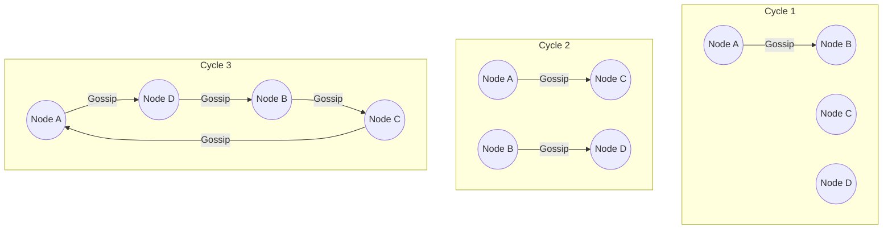

# Gossip Protocol

## Concept

- **Gossip Protocol** (or epidemic protocol) is a decentralized, peer-to-peer communication algorithm used by distributed systems to disseminate information (membership lists, configuration, node state) throughout a cluster without a central coordinator or single point of failure.
- It mimics how rumors or infectious diseases spread:
  - Periodically (e.g., every 1 second), each node selects a small number of random peers (fan-out $F$) and shares its state metadata.
  - The receiving nodes merge this metadata with their own and gossip it to another set of random peers.
  - Information propagates exponentially: in a cluster of $N$ nodes, gossip reaches all nodes in $O(\log N)$ cycles.
- Gossip protocols operate in two primary modes:
  - **Rumor Mongering**: When a node learns of a new change (e.g., node joined, key updated), it actively gossips this change to random peers. To prevent infinite loops, if a node gossips to a peer that already knows the rumor, the node's probability of gossiping it again decreases (reaches a "cold" state).
  - **Anti-Entropy**: A background process where nodes compare their entire dataset or digests (often using Merkle trees) to reconcile any missing or out-of-sync history.

## Problem It Solves

- **Centralized bottlenecks**: Traditional systems rely on a single controller or configuration registry (e.g., ZooKeeper). In a cluster with thousands of nodes, querying a single registry creates a bandwidth bottleneck. Gossip makes cluster state tracking peer-to-peer.
- **Brittle failure detection**: Instead of every node pinging every other node ($O(N^2)$ connections), nodes monitor each other via randomized gossip channels.

## Trade-offs

- **Pros**:
  - **Scalability**: The processing and network load on any single node remains constant ($O(1)$) as the cluster grows.
  - **High Fault Tolerance**: The system is self-healing. If a node fails or a network link is cut, gossip simply routes around it.
  - **Decentralization**: No master node; all nodes are peers.
- **Cons**:
  - **Eventual Convergence**: Information takes time to spread. Replicas are temporarily out-of-sync (window of inconsistency).
  - **Network Chatter**: Nodes constantly send messages even when there are no updates, which can consume significant background network bandwidth.
  - **Deleted State Tracking**: Nodes cannot simply delete a record; doing so would make other nodes gossip the "missing" record back. Systems must use **tombstones** (records marked as deleted with a timestamp) which must be retained for a safety window.

## Examples

- **Apache Cassandra**: Uses gossip to discover new nodes, monitor cluster membership, and distribute token rings.
- **Consul / Serf**: Utilizes the **SWIM (Structured Weakness Isolation and Transmission) Gossip Protocol** to detect failed nodes and manage membership lists with low latency.
- **Redis Cluster**: Master and replica nodes exchange gossip messages to detect failures, manage slots, and handle cluster reconfigurations.
- **Interview framing**:
  - When design scale exceeds hundreds of nodes and requires decentralized operation: *"To manage cluster membership and detect node failures without a central coordinator bottleneck, I will use a **Gossip Protocol (like SWIM/Serf)**. This ensures that node joins, leaves, and failures propagate to all peers in $O(\log N)$ time, while maintaining a constant bandwidth cost per node. I will mitigate gossip chatter by attaching delta states to messages instead of full node records."*
