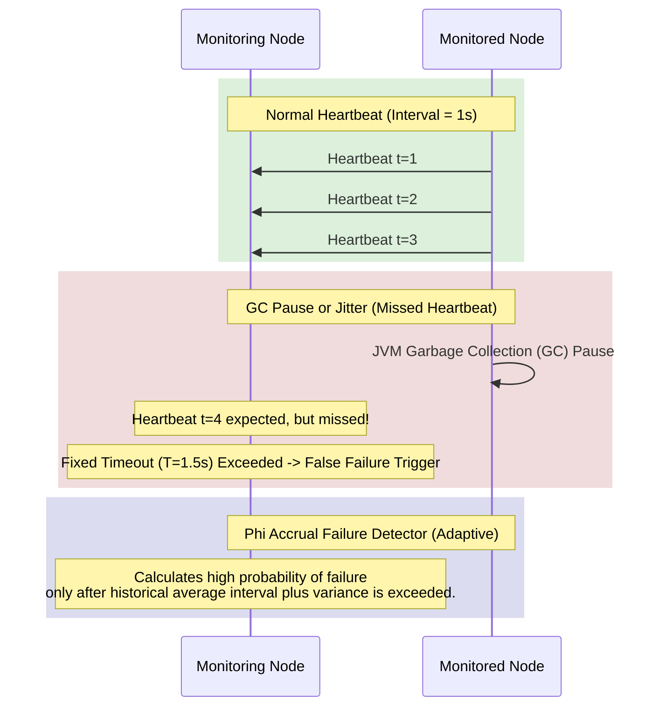

# Heartbeats and Failure Detection

## Concept

- In a distributed system, a node can fail due to crashes (fail-stop), network disconnection (fail-silent), or extreme slowdowns (e.g., resource exhaustion or garbage collection pauses).
- A **Failure Detector** is a mechanism used by nodes to determine whether their peers are online or dead.
- Two basic patterns:
  - **Heartbeats**: The monitored node periodically pushes an `"I am alive"` message to the monitoring node.
  - **Ping-Ack**: The monitoring node actively polls the monitored node and waits for an acknowledgment.

### Fixed Timeout vs. Adaptive Failure Detection

1. **Fixed-Timeout Detector**:
   - If no heartbeat is received within a duration $T$, the node is assumed dead.
   - **The Trade-off**: If $T$ is too small, transient network congestion or a JVM Garbage Collection (GC) pause will trigger a **false positive** (marking a healthy node as dead), leading to unnecessary leader elections and data re-replication. If $T$ is too large, the system remains degraded for longer before failover occurs.
2. **Phi Accrual Failure Detector (Adaptive)**:
   - Instead of returning a binary `UP/DOWN` state, it returns a continuous probability scale representing the likelihood that a node has failed.
   - It records a sliding window of recent heartbeat arrival times to model the network's latency distribution.
   - The failure metric $\Phi$ (Phi) is calculated as:
     $$\Phi = -\log_{10}(P_{\text{later}}(t - t_{\text{last}}))$$
     Where $P_{\text{later}}(t)$ is the probability that a heartbeat will arrive more than $t$ units after the previous one.
   - If $\Phi = 1$, the probability of a false detection is $0.1$. If $\Phi = 8$, the probability of a false detection is $10^{-8}$.
   - Applications configure thresholds: a low threshold (e.g., $\Phi = 2$) can be used to stop routing user requests to a node, while a high threshold (e.g., $\Phi = 8$) is used to trigger master election.

## Problem It Solves

- **Cascading Failures**: Prevents false failure detections from triggering resource-intensive node re-balancing tasks that saturate the network, which would in turn trigger further false detections.
- **Split-Brain Prevention**: Ensures clusters quickly isolate unhealthy nodes before they can cause state divergence by continuing to write to an isolated leader.

## Trade-offs

- **Fixed Timeouts**:
  - **Pros**: Easy to write and understand; zero CPU or memory footprint on the monitoring node.
  - **Cons**: Poor adaptivity to changing cloud networking conditions or fluctuating load patterns.
- **Phi Accrual detectors**:
  - **Pros**: Adapts automatically to network degradation and packet loss without human tuning. Highly accurate.
  - **Cons**: Requires keeping a sliding window of historical intervals in memory, adding slight computational and state management overhead to the monitoring daemon.

## Examples

- **Apache Cassandra**: Uses the Phi Accrual Failure Detector to dynamically detect node failures and avoid querying slow nodes.
- **Kubernetes**: Node heartbeats are published to the API server as Lease objects. If a node fails to update its Lease within a lease duration (default 40s), the controller labels it as unhealthy.
- **Consul (SWIM)**: Uses gossip pings. If a ping fails, it marks the node as "suspect" and queries other nodes to ping the target before finally declaring it dead, minimizing false alerts.
- **Interview framing**:
  - When design relies on leader election or self-healing nodes: *"To avoid the instability caused by fixed timeouts under GC pauses or network spikes, I will use an **adaptive failure detector** like the **Phi Accrual Failure Detector** used in Cassandra. By maintaining a history of heartbeat intervals, the system can distinguish transient network jitter from a true crash, allowing us to route traffic away early on low-confidence warnings while reserving heavy reelection tasks for high-confidence failure signals."*
