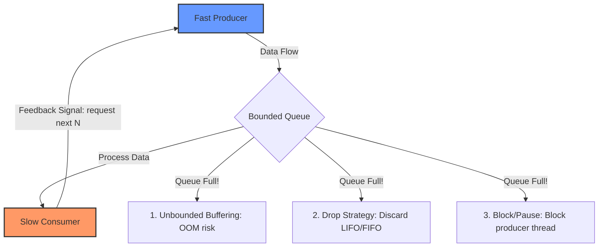

# Backpressure

## Concept

- **Backpressure** is a mechanism in software systems where a slow downstream data consumer signals a fast upstream producer to slow down or pause its transmission rate, preventing the system from running out of resources (memory, threads).
- It addresses the **Producer-Consumer speed mismatch**:
  - If a producer emits events at 10,000 req/sec but the consumer can only process 1,000 req/sec, the system must handle the extra 9,000 req/sec.
- There are four main strategies to handle this overload:

1. **Unbounded Buffering**:
   - The queue between producer and consumer grows indefinitely.
   - **Risk**: The queue eventually consumes all heap space, crashing the process with an Out-of-Memory (OOM) error.
2. **Bounded Buffering with Dropping (Load Shedding)**:
   - The queue has a maximum capacity. When full, new messages are dropped (LIFO) or the oldest messages are evicted (FIFO).
   - Useful when only the latest data is relevant (e.g., GPS coordinates, real-time stock prices).
3. **Blocking (Push-based Flow Control)**:
   - The queue has a maximum capacity. When full, the producer thread is blocked (forced to sleep/wait) until the consumer frees up slot space.
4. **Pull-based Flow Control (Reactive Streams)**:
   - The producer does not push data. Instead, the consumer sends demand signals requesting a specific number of items ($N$). The producer only sends up to $N$ items and then pauses until the next request signal.

## Problem It Solves

- **Out-of-Memory (OOM) crashes**: Stops queue structures from growing without limit.
- **Cascading failures**: Stops a slow database or downstream dependency from backing up and crashing the entire server pool.
- **Latency inflation**: Prevents queue wait times from growing indefinitely, ensuring predictable system response times (as guided by Little's Law: $L = \lambda W$).

## Trade-offs

- **Dropping / Load Shedding**:
  - **Pros**: Zero memory bloat; guarantees very low latency for the messages that *are* processed.
  - **Cons**: Data loss. Unacceptable for transactional flows (e.g., payment logs, order creation).
- **Blocking / Pausing**:
  - **Pros**: Zero data loss; simple programming model.
  - **Cons**: Blocks active execution threads. If threads block all the way upstream, the entire server runs out of connection sockets, taking down the entry API gateway.
- **Pull-based Asynchronous Backpressure**:
  - **Pros**: Non-blocking; extremely safe and resilient under massive spikes.
  - **Cons**: Complex to implement. Requires asynchronous framework support (e.g., RxJava, Akka Streams) across the codebase.

## Examples

- **TCP Flow Control (TCP Windowing)**: The receiver advertises a `Receive Window (RWIN)` in its TCP headers. If the receiver's buffer fills up, it sends `RWIN = 0`, forcing the sender to stop transmitting packets.
- **Kafka Consumers**: Kafka uses a pull model. Consumers fetch messages using `poll()`. If a consumer slows down, it simply polls less frequently, letting messages pile up safely on the disk-backed broker rather than in client memory.
- **Reactive Streams / Project Reactor**: In Java (WebFlux) and Node.js, libraries use `request(n)` signals to pull items downstream.
- **Interview framing**:
  - When designing high-throughput data pipelines or event-driven systems: *"To prevent a spike in traffic from causing Out-of-Memory (OOM) errors or cascading node failures, I will enforce **backpressure** using **bounded queues** at intermediate stages. Instead of pushing data blindly, I will use a **pull-based model** (similar to Kafka's consumer poll loop) where downstream nodes query for a specific batch size when they have idle thread capacity. If we cannot tolerate queue delays, I will configure **load-shedding** at the gateway to drop low-priority telemetry early."*
