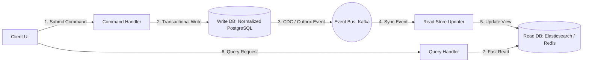

# CQRS (Command Query Responsibility Segregation)

## Concept

- **CQRS** is an architectural pattern that segregates the operations that mutate state (Commands) from the operations that read state (Queries) into completely distinct models, pipelines, and often distinct databases.
- Traditional CRUD architectures use the same domain model and database tables for both reads and writes. In high-scale systems, this leads to complex, slow queries and database locking.
- CQRS splits the application into two paths:
  - **Commands (Write Path)**: Represent actions that change state (e.g., `SubmitOrder`, `AddDiscount`). Commands are task-centric, do not return data (except transaction status/ID), and enforce domain business rules.
  - **Queries (Read Path)**: Represent read-only data fetches (e.g., `GetOrderDetails`, `SearchProducts`). Queries bypass domain validation, fetch denormalized data, and return flat Data Transfer Objects (DTOs) tailored to UI needs.

- **Dual-Database Architecture**: The write database is highly normalized (3NF) to support transactional integrity and quick writes. The read database is denormalized (e.g., Elasticsearch, Cassandra, or pre-calculated materialized tables) to allow fast reads without complex joins.
- **Asynchronous Sync**: The write store publishes events (using the Outbox pattern, Phase 3, topic 36) to an event bus (Kafka, RabbitMQ) to update the read store asynchronously, making the read tier **eventually consistent**.

## Problem It Solves

- **Read/Write Asymmetry**: In most internet applications, reads outnumber writes by ratios like 100:1 or 1000:1. CQRS allows the read database to scale out horizontally (e.g., replicating Elasticsearch) without having to scale the more expensive write database.
- **Join-Heavy Query Latency**: Relational tables require expensive joins to construct complex views (e.g., compiling order details, shipping data, and customer reviews). The CQRS read store contains pre-joined, denormalized documents that can be fetched in a single lookup.

## Trade-offs

- **Pros**:
  - **Independent Scaling**: Read and write infrastructure can be scaled and optimized separately.
  - **Optimized Data Schemas**: Write path is optimized for inserts/locking; read path is optimized for retrieval/indexing.
  - **Separation of Concerns**: Simplifies code by removing query logic from the core business validation engine.
- **Cons**:
  - **System Complexity**: Requires managing multiple databases, sync queues, and background processors.
  - **Eventual Consistency Lag**: The read store is slightly behind the write store. Users might modify a resource and not see the update immediately.
  - **Reconciliation Overhead**: If the event bus drops sync events, the read store drifts permanently. A background synchronization cron (anti-entropy) is required.

## Examples

- **E-Commerce Search**: Command writes to a PostgreSQL database. Changes trigger events sent via Kafka to index data into **Elasticsearch**. Reads (product catalog searches) hit Elasticsearch directly.
- **Collaborative Workspaces (Figma/Google Docs)**: Document mutations (commands) write to a transactional operational log. Collaborative views (queries) read from a highly optimized client-side in-memory canvas model.
- **Financial Audit Ledgers**: Command appends transaction details to a ledger. Queries read from pre-calculated cache layers containing current balances.
- **Interview framing**:
  - When designing high-scale read-heavy systems (like a hotel booking system, e-commerce catalog, or social feed): *"To handle the extreme read-to-write asymmetry, I will implement **CQRS**. The write path will use PostgreSQL to ensure ACID invariants, while the read path will query a denormalized **Elasticsearch** cluster. We will sync them asynchronously using Kafka and the Outbox pattern. To shield users from eventual consistency lag, the UI will employ **optimistic updates** or hold a local state buffer until the event propagates."*
