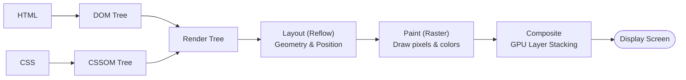

# Browser Rendering Pipeline

## Concept

- The **Browser Rendering Pipeline** is the sequence of stages a browser's rendering engine (Blink, WebKit, Gecko) executes to convert raw HTML, CSS, and JavaScript into interactive pixels on screen.
- Understanding this pipeline is the cornerstone of frontend performance and smooth 60fps / 120fps animations, because different operations trigger different entry points in the pipeline.
- The pipeline proceeds through six distinct stages:
  1. **DOM Construction**: HTML parser tokens are turned into nodes forming the Document Object Model tree. HTML parsing is incremental and streaming.
  2. **CSSOM Construction**: CSS rules are parsed into the CSS Object Model. Unlike HTML, CSS is render-blocking; the browser cannot construct the render tree until all CSS is parsed because styles cascade and override.
  3. **Render Tree Generation**: The DOM and CSSOM are combined. Only visible elements (`display: none` is omitted; `visibility: hidden` is included) and their computed styles are attached to render tree nodes.
  4. **Layout (Reflow)**: Computes the exact geometric coordinates and bounding box dimensions (width, height, position) for each node relative to the viewport.
  5. **Paint (Rasterization)**: Converts geometric render tree boxes into visual pixels (colors, borders, text, shadows, image decoding) across multiple layers.
  6. **Compositing**: Flattens independent GPU layers in the correct stacking context order (z-index) to draw onto the screen.



## Problem It Solves

- Provides an efficient, deterministic abstraction for displaying dynamic hypermedia across diverse hardware and screen resolutions.
- Separates geometric calculation (Layout) from pixel rasterization (Paint) and GPU composition (Composite), allowing browsers to optimize updates: if only colors change, layout is skipped; if only transforms/opacity change, both layout and paint are skipped.

## Trade-offs

- **Layout Thrashing (Forced Synchronous Layout)**:
  - Reading geometric properties (`offsetWidth`, `clientHeight`, `scrollTop`, `getBoundingClientRect()`) right after writing styles forces the browser to run layout prematurely before batching, plummeting frame rates from 60fps to under 10fps.
- **Paint Invalidation Cost**:
  - Changing properties like `color`, `background-color`, or `box-shadow` skips layout but triggers paint. Repainting large regions or complex effects (blurs, gradients) spikes CPU/GPU rasterization times.
- **Compositing vs. Memory Bloat**:
  - Promoting elements to their own GPU compositor layer (`will-change: transform`, `translateZ(0)`) avoids layout and paint during animations. However, excessive layer promotion consumes significant GPU VRAM and can crash low-end mobile devices.
- **Single Main Thread Bottleneck**:
  - DOM parsing, style calculation, layout, paint, and JavaScript execution all share the browser's **Main Thread**. Long-running JS tasks block layout updates and user interactions (directly degrading INP / Interaction to Next Paint).

## Examples

- **Hardware-Accelerated Animation (Compositor-Only)**
  - Animating with `transform: translate3d(x, y, 0)` and `opacity` bypasses both Layout and Paint completely. The GPU handles layer transformation directly on the compositor thread, guaranteeing butter-smooth 60fps animations even if the main thread is busy.
- **Forced Synchronous Layout Trap**
  - Iterating over elements and reading `el.offsetWidth` while modifying `el.style.width` forces layout computation inside each iteration loop:
    ```javascript
    // BAD: Layout thrashing (forces layout N times)
    elements.forEach(el => {
      const w = el.offsetWidth;
      el.style.width = (w + 10) + 'px';
    });

    // GOOD: Batch reads first, then batch writes
    const widths = elements.map(el => el.offsetWidth);
    elements.forEach((el, i) => {
      el.style.width = (widths[i] + 10) + 'px';
    });
    ```
- **Layer Promotion with `will-change`**
  - Using `will-change: transform` on an off-canvas drawer tells the browser to create a dedicated backing surface before the animation begins, avoiding jank on initial swipe.
- **Interview Framing**
  - Always explain the pipeline in terms of performance cost hierarchy: **Layout > Paint > Composite**. For any UI design or animation round, highlight that mutating geometry properties (`width`, `margin`, `top`) forces expensive Reflow + Repaint + Composite; mutating visual styles (`color`, `background`) triggers Repaint + Composite; whereas `transform` and `opacity` run exclusively on the GPU compositor thread without stalling the main thread.
