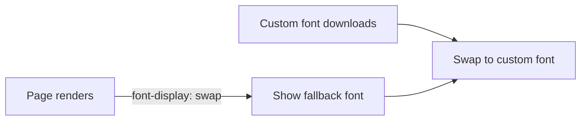

# Font Loading Strategies

## Concept

- Web fonts improve branding but are **render-blocking-ish** resources that can hurt performance and cause text-rendering glitches. Font loading strategy controls *how text is shown while a custom font downloads*.
- The core problem is the gap between page render and font availability, which produces:
  - **FOIT (Flash of Invisible Text)** — text is hidden until the font loads (blank text, bad for perceived load and LCP).
  - **FOUT (Flash of Unstyled Text)** — fallback font shows immediately, then swaps to the custom font (visible reflow/flicker).
- The main tool is the CSS **`font-display`** descriptor: `swap` (show fallback immediately, swap when ready — avoids FOIT), `optional` (use the font only if it loads almost instantly, else stick with fallback — best for performance), `block`, `fallback`.
- Complementary techniques: **preload** the critical font, **subset** it (include only needed glyphs), use **WOFF2** (best compression), and **self-host** to avoid third-party connection cost.

## Problem It Solves

- Ensures **text is visible quickly** (no blank FOIT period), improving perceived performance and LCP (text is often the LCP element).
- Gives explicit control over the load-time appearance trade-off (invisible vs. swapped text) instead of leaving it to default browser behavior.
- Reduces font-driven layout shift and the cost of large/blocking font files.

## Trade-offs

- **`swap` vs. `optional`** — `swap` guarantees the brand font appears but causes a visible swap/reflow (and possible CLS if metrics differ); `optional` avoids the swap and CLS by *not* using the font if it's slow, at the cost of sometimes not showing the brand font at all.
- **FOUT reflow / CLS** — swapping fonts with different metrics shifts text; mitigate with `size-adjust`/`ascent-override` or fallback fonts matched to the web font's metrics.
- **Preload vs. bandwidth** — preloading the font speeds its arrival but competes for bandwidth with other critical resources; preload only the one or two fonts needed above the fold.
- **Self-host vs. third-party** — self-hosting avoids an extra DNS/TLS connection to a font CDN (faster, privacy-friendly) but you manage the files; third-party (Google Fonts) is convenient but adds connection latency.
- **Subsetting** — dramatically cuts size but you must include all glyphs your content needs (and dynamic content may need more).

## Examples

- **Swap + preload + WOFF2 subset**
  - `@font-face { font-display: swap; src: url(brand.woff2) format('woff2'); }` plus `<link rel="preload" as="font" type="font/woff2" crossorigin>` and a Latin-subset file — visible text immediately, brand font swaps in fast.
- **`optional` for performance-critical pages**
  - On a landing page where LCP matters most, `font-display: optional` avoids any swap/CLS, using the brand font only if it's cached/instant.
- **Metric-matched fallback**
  - A system-font fallback tuned with `size-adjust` so the swap from fallback to web font doesn't shift layout (no CLS).
- **Interview framing**
  - When fonts come up in a performance discussion, mention `font-display: swap` (or `optional`), preloading critical fonts, WOFF2 + subsetting, self-hosting, and matching fallback metrics to avoid CLS. Framing it as the FOIT/FOUT/CLS trade-off shows you understand the real user-visible impact.
